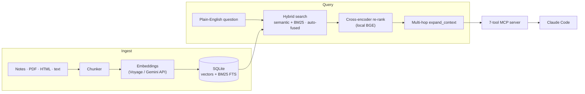

# corpus-rag

[](https://pypi.org/project/corpus-rag/) [](https://pypi.org/project/corpus-rag/) [](https://github.com/monahand1023/corpus/actions/workflows/ci.yml) [](LICENSE)

Your personal archive — notes, PDFs, docs — queryable in plain English, stored and searched entirely on your machine.

A personal knowledge system shouldn't require a vector database service, a SaaS subscription, or handing your whole archive to someone else's cloud. `corpus` is one Python process, one SQLite file, one MCP server — the database, index, and search all run locally. (One honest caveat: the text you ingest or query is sent to your chosen embedding API — Voyage or Gemini — to be turned into vectors. See [what corpus doesn't do](#what-corpus-doesnt-do).) Add a `corpus.toml`, point it at your data, run `corpus-ingest`, and Claude Code can search years of notes in under 300ms.

## How it works



Point it at any directory of markdown / PDF / HTML / text files and get:

- Semantic + BM25 hybrid search with auto-tuned fusion weights
- Source-diversity-aware retrieval (no single doc floods top-K)
- Multi-hop reference chasing via `expand_context`
- Optional cross-encoder re-ranker (local, BGE)
- Optional per-document Claude-Haiku summaries
- Seven MCP tools wired into Claude Code over stdio

**Stack:** Python 3.12–3.14 • Voyage or Gemini embeddings (optional extras) • SQLite + sqlite-vec • FastMCP. No AWS, no Docker, no Terraform.

---

## Quick start

```sh
# 1. Install — pick an embedder extra ([voyage] recommended, or [gemini])
pip install 'corpus-rag[voyage]'      # base + Voyage embeddings (recommended)
pip install 'corpus-rag[all]'         # + reranker, summarizer, pdf, html, gemini
# Bare `pip install corpus-rag` is the minimal, provider-agnostic base — you
# must add an embedder extra before you can ingest or query. Why it's split out:
# see "Why embedders are optional" in docs/configuration.md.

# 2. Interactive setup wizard — generates corpus.toml + .env
corpus-init

# 3. Paste your VOYAGE_API_KEY (free tier covers ~200M tokens) into .env
#    Sign up at https://dash.voyageai.com/  — or pick Gemini in the wizard
#    to use Google AI Studio's free tier instead.

# 4. Run the first ingest
corpus-ingest --source notes -v

# 5. Try it from the CLI
corpus-query "the question you wish you could ask your archive"

# 6. Wire it to Claude Code or Claude Desktop — see "MCP server" below
```

`corpus-init` walks you through 5 prompts (data path, format, embedder provider, etc.) and writes a working `corpus.toml`. No need to hand-edit anything to get started.

## Configuration

Everything that varies between deployments lives in `corpus.toml`. The wizard generates a starter file; edit by hand from there.

```toml
[corpus]
db_path = "./corpus.db"

[embedder]
provider = "voyage"           # or "gemini"
model = "voyage-3-large"
dim = 1024                    # must match the model's output dim

[retriever]
top_k = 5
max_per_source_type = 3       # diversity cap
hybrid = true                 # vector + BM25 via RRF

[[sources]]
name = "notes"                # free-form; used as source_type everywhere
type = "markdown"             # which built-in connector to use
path = "~/Documents/notes"
glob = "**/*.md"

[[references]]
# Optional. When set, `expand_context` chases these patterns across docs and
# the BM25 weight auto-tunes higher when the user's query contains a match.
pattern = '\b[A-Z]{2,}-\d+\b'
source_type = "tickets"
description = "Jira-style ticket keys"
```

Schema hazard: changing `embedder.dim` after data has been ingested would silently corrupt retrieval. `corpus` validates the dim against the existing schema at startup and refuses to proceed on mismatch.

## Ingesting content

Ingestion turns a directory of files into searchable chunks. Point a `[[sources]]` block in `corpus.toml` at your data, then run the ingester:

```sh
corpus-ingest --source notes -v      # one source, verbose
corpus-ingest --all                  # every source in corpus.toml
```

What each run does:

1. **Walks** the source `path` for files matching `glob`. Symlinks and any path that resolves outside the configured directory are skipped — a stray symlink can't pull in files you didn't mean to index.
2. **Parses & chunks** each file with the connector for its `type` (frontmatter, headings, paragraph boundaries).
3. **Scrubs** obvious secrets (API keys, private-key blocks) out of the chunk text *before* anything is embedded or stored.
4. **Embeds** each chunk via your provider (Voyage or Gemini) and **stores** the vector + BM25 full-text index in SQLite.

Ingestion is **idempotent and incremental** — re-running it:

- **skips unchanged chunks** (matched by content hash — no re-embedding, no API cost),
- **re-embeds only what's new or changed**,
- **prunes orphans** — chunks whose source file was deleted are removed,
- **skips near-duplicate files** (identical body under a different name) within a run.

So the update loop is just: edit your files, re-run `corpus-ingest`. There's **no daemon or file watcher** — ingestion happens when you run the command. Dates come from frontmatter (`created`/`modified`) if present, else the file's modification time.

Out-of-the-box formats: **markdown**, **text**, **pdf** (`[pdf]` extra), **html** (`[html]` extra) — see [Built-in connectors](#built-in-connectors). For anything else (Slack exports, JSON dumps, EPUB…), write a small connector: [`docs/adding_a_source.md`](docs/adding_a_source.md).

## MCP server

Wire `corpus` into **Claude Code** or **Claude Desktop** — both use stdio and the same config format. **Pass the absolute path to your `corpus.toml`** via `--config` — the client spawns the MCP server from an arbitrary CWD, so a relative path won't reliably find your config.

**Claude Code** — add to `~/.claude.json`:

```json
{
  "mcpServers": {
    "corpus": {
      "type": "stdio",
      "command": "corpus-mcp",
      "args": ["--config", "/absolute/path/to/your/corpus.toml"],
      "env": {}
    }
  }
}
```

After `pip install 'corpus-rag[voyage]'` (or another embedder extra), `corpus-mcp` is on your PATH. The client spawns it on demand.

**Claude Desktop** — add to `~/Library/Application Support/Claude/claude_desktop_config.json` (macOS):

```json
{
  "mcpServers": {
    "corpus": {
      "command": "uv",
      "args": [
        "--directory", "/absolute/path/to/your/corpus",
        "run", "corpus-mcp"
      ]
    }
  }
}
```

Use an absolute path to `uv` if it's not on the client's PATH. See [`docs/mcp_integration.md`](docs/mcp_integration.md) for more detail, including multiple-corpus setups.

Seven tools exposed:

| Tool | Purpose |
|---|---|
| `search_knowledge` | Hybrid BM25+vector search with dedupe + diversity |
| `expand_context` | Chase references from a chunk — siblings, cited docs, parent |
| `get_doc` | Pull every chunk of a specific document |
| `timeline` | Search results reordered chronologically |
| `recent_activity` | Chunks updated in the last N days |
| `get_summary` | Cached Claude-Haiku summary (after running `corpus-summarize`) |
| `corpus_stats` | Health check — total chunks + per-source counts |

The **investigation pattern** is the high-leverage flow: Claude calls `search_knowledge` to find entry points, then `expand_context` on the top result to pull in adjacent material (other chunks of the same doc, referenced doc IDs, parent links), then synthesizes from the full picture.

## CLI reference

```sh
corpus-init                              # interactive setup wizard
corpus-init --quiet                      # non-interactive (accept defaults; for CI)
corpus-list                              # show configured sources + chunk counts
corpus-ingest --source notes -v          # ingest one source
corpus-ingest --all                      # ingest everything in corpus.toml
corpus-query "your question" -k 10       # ad-hoc search
corpus-query "question" --source notes   # source-filtered
corpus-query "question" --rerank         # local BGE reranker (opt-in)
corpus-eval --queries my_queries.py      # recall@k against your queries
corpus-benchmark --runs 20               # latency profile
corpus-benchmark --compare voyage gemini # embed-latency A/B
corpus-summarize --source notes --dry-run    # estimate Haiku spend
corpus-summarize --source notes              # run it
corpus-reset --source notes              # drop one source's chunks
corpus-reset --all                       # delete the whole DB
corpus-mcp                               # stdio MCP server (Claude spawns it)
```

## Built-in connectors

| `type` | Default glob | Extra needed | Notes |
|---|---|---|---|
| `markdown` | `**/*.md` | — | YAML frontmatter parsed (`title`, `id`, `url`, dates) |
| `text` | `**/*.txt` | — | Plain text; title from filename stem |
| `pdf` | `**/*.pdf` | `pip install 'corpus-rag[pdf]'` | Uses `pypdf`. Scanned PDFs need OCR first. |
| `html` | `**/*.{html,htm}` | `pip install 'corpus-rag[html]'` | Uses `trafilatura` for boilerplate-stripped main-content extraction |

## Adding a new source type

For Slack exports, JSON dumps, an internal API archive, EPUB books — write your own connector. See [`docs/adding_a_source.md`](docs/adding_a_source.md) for the walkthrough with a worked JSON-files example.

## Eval

`corpus-eval` runs hand-written known-answer queries against the live corpus and reports **recall@K, MRR, and nDCG@K**, plus an aggregate table, a per-source-type breakdown, and `--json`. It's a regression signal — run it after changing chunking, switching embedders, or tweaking retrieval.

**Zero setup, no API key:** `corpus` ships a committed sample corpus (`examples/sample_corpus/` — 20 docs, two source types) and a keyless `hash` embedder (`provider="hash"`) so you can try the whole eval loop with nothing installed and no key on file:

```sh
uv run corpus-ingest --config examples/sample_corpus/corpus.toml --all
uv run corpus-eval   --config examples/sample_corpus/corpus.toml
```

```
=== Aggregate (n=30) ===
  recall@5: 1.000
  MRR:       0.865
  nDCG@5:   0.898

=== By source_type ===
  source_type         n   recall      mrr     ndcg
  faq                11    1.000    0.955    0.966
  note               19    1.000    0.813    0.859
```

The `hash` embedder is a **reproducibility substrate, not a semantic-quality model** — it approximates lexical overlap, not meaning. It exists so the eval (and CI) has a deterministic, free baseline. Absolute retrieval quality is measured on your real corpus with `voyage` or `gemini`. See [`docs/eval.md`](docs/eval.md) for the exact metric formulas and that distinction in full.

CI runs this same keyless flow as a regression gate (`eval-gate` in `.github/workflows/ci.yml`): it fails the build if the sample corpus's recall@5 or nDCG@5 drops below the floors in `examples/sample_corpus/thresholds.json` — see [docs/eval.md](docs/eval.md#ci-gate-phase-3) for details.

Write your own queries in any Python file that defines `EVAL_QUERIES`, then pass `--queries path/to/your_queries.py`:

```python
# my_queries.py
from dataclasses import dataclass, field

@dataclass(frozen=True)
class EvalQuery:
    query: str
    expected_keys: list[str] = field(default_factory=list)
    source_filter: list[str] | None = None
    source_type: str | None = None   # bucket tag for the per-source-type breakdown
    note: str = ""

EVAL_QUERIES = [
    EvalQuery(
        query="how does the payment flow work?",
        expected_keys=["payment-design-doc"],
        source_type="doc",
        note="paraphrased to stress semantic retrieval",
    ),
    # add more...
]
```

```sh
corpus-eval --queries my_queries.py --top-k 5     # baseline
corpus-eval --queries my_queries.py --rerank      # with the BGE reranker
corpus-eval --queries my_queries.py --no-hybrid   # vector-only baseline
corpus-eval --queries my_queries.py --compare     # metric x config table (hybrid vs vector-only vs +rerank)
corpus-eval --queries my_queries.py --json        # structured output for tooling / CI
```

`--compare` runs the whole query set under several retrieval configs in one invocation:

```
=== Config comparison (top_k=5) ===
  config             recall      mrr     ndcg
  hybrid              1.000    0.865    0.898
  vector-only         0.933    0.838    0.861
```

**Finding:** on this corpus, hybrid beats vector-only on all three metrics — recall 1.000 vs. 0.933, MRR 0.865 vs. 0.838, nDCG@5 0.898 vs. 0.861 — so fusing BM25 with vectors earns its place even on a purely lexical `hash` embedder ([full writeup](docs/eval.md#results)).

Tips: paraphrase away from doc titles to stress semantic retrieval on a real embedder (the shipped sample-corpus queries deliberately do the opposite, since the `hash` embedder has only lexical overlap to work with); list multiple `expected_keys` when several docs are valid answers; add a few negative queries (empty `expected_keys`) to confirm the corpus correctly fails on absent topics.

See [`docs/eval.md`](docs/eval.md) for the full methodology — precise metric definitions, the `EvalQuery` schema, and reading the reports and `--json` shape. New to evals entirely? [`docs/understanding-evals.md`](docs/understanding-evals.md) explains RAG and evaluation from scratch (no prior knowledge assumed).

## Generation quality (LLM-as-judge)

`corpus-eval` scores *retrieval*; `corpus-judge` scores the *answer generated
from* what was retrieved. It runs retrieve → answer-from-context → judge, rating
each answer on three axes — **faithfulness**, **answer relevance**, and
**citation correctness** — with a stronger model judging than generating. The
judge itself is validated against human labels via Cohen's κ (`--validate`), so
its verdicts are trustworthy before you rely on them. Requires
`ANTHROPIC_API_KEY`; it never runs over a private corpus in CI (see
[`docs/judge.md`](docs/judge.md)).

```sh
corpus-judge --queries my_queries.py --config corpus.toml            # 3-axis aggregate
corpus-judge --queries my_queries.py --config corpus.toml --rerank   # +BGE reranker
corpus-judge --validate --fixture tests/judge_fixture.py             # certify the judge (κ)
```

Because the judge scores answers against the retrieved context, the loop also
**measures whether a retrieval change helps generation**: run with and without
`--rerank` (or vary `--top-k`) and compare the aggregates — the signal is the
delta between configs, not any single absolute rate.

## Benchmarking

`corpus-benchmark` measures per-stage retrieval latency (embed / vector / FTS / fusion / dedupe) with p50/p95/p99 + throughput.

```sh
corpus-benchmark --runs 20                      # latency profile
corpus-benchmark --queries my_queries.py        # use your own query set
corpus-benchmark --compare voyage gemini        # embed-latency A/B
corpus-benchmark --json out.json
```

Typical profile on an M-series Mac, few-thousand-chunk corpus: `embed` dominates at 100–300ms (provider API round-trip), while `vector_search` / `fts_search` / `fusion` / `dedupe` are collectively under ~5ms. The optimization lever is "fewer or concurrent embed calls," not "faster SQLite." If `vector_search` exceeds ~50ms you've outgrown brute-force `vec0` (~100K chunks) and want HNSW indexing.

`--compare` measures embedder-API latency only — it does **not** compare retrieval quality, because two providers' vectors aren't comparable against one DB. For quality, ingest each provider into its own corpus and run `corpus-eval` against each.

## What corpus doesn't do

`corpus` is deliberately small and single-purpose. The following are **non-goals, not missing features** — know them before you adopt it:

- **Not multi-user.** One person, one machine. No accounts, auth, access control, sharing, or multi-tenancy.
- **No network service.** It talks over stdio (the MCP server) and the CLI — there is no HTTP/REST/SSE API and no web UI.
- **Embedding is not local, for real retrieval.** Storage, the vector + full-text index, hybrid search, and the optional reranker all run on your machine — but turning text into vectors for actual semantic search requires the **Voyage or Gemini API** (an API key + network at ingest and query time). The only built-in offline embedder, `provider="hash"` (see [Eval](#eval)), is a keyless lexical-overlap substrate for eval/CI reproducibility, not a semantic-quality model — for real retrieval, the text you ingest and your queries are sent to whichever provider you pick. If that's a dealbreaker, this isn't the tool.
- **Not built for huge corpora.** Vector search is a brute-force scan (sqlite-vec `vec0`), fast to roughly **100K chunks**. Beyond that you'd want ANN/HNSW indexing, which isn't included.
- **No OCR.** Scanned or image-only PDFs produce no text — OCR them first.
- **No live sync.** No file watcher and no real-time/incremental indexing daemon — you re-run `corpus-ingest` when content changes.
- **Not an LLM or chatbot.** `corpus` only *retrieves* — it finds and returns the relevant chunks. The answering/reasoning is done by whatever model consumes them (e.g. Claude via the MCP server).
- **Python 3.12+ only** (tested on 3.12, 3.13, and 3.14).

If you need any of the above, `corpus` is the wrong starting point — though its pieces (the SQLite schema, connectors, retriever) are small enough to lift into something larger.

## Documentation

| Doc | What it covers |
|---|---|
| [`docs/understanding-evals.md`](docs/understanding-evals.md) | **New to RAG or evals? Start here.** RAG and AI evaluation explained from scratch — retrieval vs generation, LLM-as-judge, Cohen's κ, reading results, and the noise trap |
| [`docs/configuration.md`](docs/configuration.md) | Every `corpus.toml` setting + env var, including the Voyage-vs-Gemini embedder choice |
| [`docs/mcp_integration.md`](docs/mcp_integration.md) | Claude Code + Claude Desktop wiring, all 7 tools, the investigation pattern |
| [`docs/adding_a_source.md`](docs/adding_a_source.md) | Walkthrough for writing a custom connector |
| [`docs/troubleshooting.md`](docs/troubleshooting.md) | Common problems and the actual fixes |

Architecture overview, benchmarking, and eval methodology are covered inline in this README (sections above).

## Develop locally

Want to hack on the framework, write a new connector, or run the tests? Clone and use [uv](https://docs.astral.sh/uv/):

```sh
git clone https://github.com/monahand1023/corpus.git
cd corpus
uv sync --all-extras                 # creates .venv with all deps (incl. embedders)
uv run pytest tests/ -q              # run the suite
uv run ruff check src/ tests/        # lint
uv run corpus-init                   # the CLI scripts are also available via `uv run`
```

The repo includes `examples/sample_corpus/` (synthetic markdown notes) and `examples/corpus.toml.example` (wired to point at it) for try-before-you-config experiments.

## License

MIT — see [LICENSE](LICENSE).
