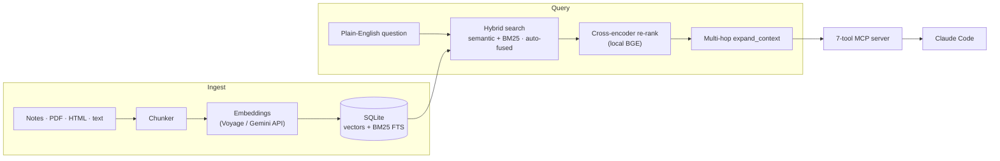

# corpus-rag

[](https://pypi.org/project/corpus-rag/) [](https://pypi.org/project/corpus-rag/) [](https://github.com/monahand1023/corpus/actions/workflows/ci.yml) [](LICENSE)

Your personal archive — notes, PDFs, documents, and the speech inside your audio and video — queryable in plain English, stored and searched entirely on your machine.

A personal knowledge system shouldn't require a vector database service, a SaaS subscription, or handing your whole archive to someone else's cloud. `corpus` is one Python process, one SQLite file, one MCP server — the database, index, and search all run locally. (One honest caveat: the text you ingest or query is sent to your chosen embedding API — Voyage or Gemini — to be turned into vectors. See [what corpus doesn't do](#what-corpus-doesnt-do).) Run `corpus-init` once, point `corpus-index` at a folder, and Claude Code can search years of notes in under 300ms. There are **17 connectors** — markdown, PDF, DOCX, XLSX, HTML, CSV, zip archives and more — plus [`corpus-transcribe`](#corpus-transcribe-speech-into-the-index) for recordings.

New here? [Quick start](#quick-start) gets you searching. [`docs/testing.md`](docs/testing.md) explains how the project establishes that any of this actually works, which is the part most RAG projects leave out.

## How it works


```mermaid
flowchart LR
    subgraph Ingest
      Src["Notes · PDF · HTML · text"] --> Ch["Chunker"]
      Ch --> Emb["Embeddings<br/>(Voyage / Gemini API)"]
      Emb --> DB[("SQLite<br/>vectors + BM25 FTS")]
    end
    subgraph Query
      Q["Plain-English question"] --> Hy["Hybrid search<br/>semantic + BM25 · auto-fused"]
      DB --> Hy
      Hy --> RR["Cross-encoder re-rank<br/>(local BGE)"]
      RR --> Exp["Multi-hop expand_context"]
    end
    Exp --> MCP["7-tool MCP server"]
    MCP --> CC["Claude Code"]
```

Point it at any directory of **text-bearing documents** — markdown, PDF,
HTML, plain text, Word, PowerPoint, Excel/CSV, RTF, zip archives, Apple
Contacts, Outlook `.olm` — and get:

- Semantic + BM25 hybrid search with auto-tuned fusion weights
- Source-diversity-aware retrieval (no single doc floods top-K)
- Multi-hop reference chasing via `expand_context`
- Optional cross-encoder re-ranker (local, BGE)
- Optional per-document Claude-Haiku summaries
- Seven MCP tools wired into Claude Code over stdio

**Stack:** Python 3.12–3.14 • Voyage or Gemini embeddings (optional extras) • SQLite + sqlite-vec • FastMCP. No AWS, no Docker, no Terraform.

---

## Quick start

```sh
# 1. Install — pick an embedder extra ([voyage] recommended, or [gemini])
pip install 'corpus-rag[voyage]'      # base + Voyage embeddings (recommended)
pip install 'corpus-rag[all]'         # + reranker, summarizer, pdf, html, gemini
# Bare `pip install corpus-rag` is the minimal, provider-agnostic base — you
# must add an embedder extra before you can ingest or query. Why it's split out:
# see "Why embedders are optional" in docs/configuration.md.

# 2. Interactive setup wizard — generates corpus.toml + .env
corpus-init

# 3. Paste your VOYAGE_API_KEY (free tier covers ~200M tokens) into .env
#    Sign up at https://dash.voyageai.com/  — or pick Gemini in the wizard
#    to use Google AI Studio's free tier instead.

# 4. Point it at a folder — survey, plan, confirm, ingest, in one command
corpus-index ~/Documents              # add --dry-run to see the plan first

# 5. Try it from the CLI
corpus-query "the question you wish you could ask your archive"

# 6. Wire it to Claude Code or Claude Desktop — see "MCP server" below
```

`corpus-init` walks you through 5 prompts (data path, format, embedder provider, etc.) and writes a working `corpus.toml`. No need to hand-edit anything to get started.

**Step 3 is not optional and step 4 needs it.** `corpus-index` reads
`corpus.toml` for the database path and embedder, so it fails with
`corpus.toml not found` if you skip the wizard. From there it is genuinely one
command per folder: it detects every file type present, names the sources,
writes them to `corpus.toml`, prices the run, asks, and ingests.

**Audio and video are a second command, on purpose.** `corpus-index` reports
them as a gap and tells you so:

```
Of those, .m4a, .mov hold SPEECH that can be transcribed and indexed.
Run `corpus-transcribe <path>` first, then re-run this command
```

Everything `corpus-index` does is seconds of I/O; transcription is hours of
local compute, so it is not hidden behind a `y` at an indexing prompt. See
[corpus-transcribe](#corpus-transcribe-speech-into-the-index).

## Configuration

Everything that varies between deployments lives in `corpus.toml`. The wizard generates a starter file; edit by hand from there.

```toml
[corpus]
db_path = "./corpus.db"

[embedder]
provider = "voyage"           # or "gemini"
model = "voyage-4-large"
dim = 1024                    # must match the model's output dim

[retriever]
top_k = 5
max_per_source_type = 3       # diversity cap
hybrid = true                 # vector + BM25 via RRF

[[sources]]
name = "notes"                # free-form; used as source_type everywhere
type = "markdown"             # which built-in connector to use
path = "~/Documents/notes"
glob = "**/*.md"

[[references]]
# Optional. When set, `expand_context` chases these patterns across docs and
# the BM25 weight auto-tunes higher when the user's query contains a match.
pattern = '\b[A-Z]{2,}-\d+\b'
source_type = "tickets"
description = "Jira-style ticket keys"
```

Schema hazard: changing `embedder.dim` after data has been ingested would silently corrupt retrieval. `corpus` validates the dim against the existing schema at startup and refuses to proceed on mismatch.

## Credentials

Every CLI and the MCP server resolve API keys (`VOYAGE_API_KEY`, `GEMINI_API_KEY`/`GOOGLE_API_KEY`, `ANTHROPIC_API_KEY`) the same, predictable way, regardless of whether corpus is invoked as a console script (`corpus-query`) or imported as a library — both funnel through the same resolution, so which one you used never changes the answer. In order:

1. **An environment variable that's already set.** Never overwritten by a `.env` file — your real shell or CI environment always wins.
2. **A `.env` file next to the config file passed via `--config`.** This is the normal setup for a private archive repo: keep `corpus.toml` (or `docs.toml`, etc.) and `.env` together in that repo, and run the CLI from wherever you like.
3. **A `.env` file found by walking up from the current working directory.**
4. **Nothing.** corpus fails with a clear error naming the missing variable and exactly where it looked (beside `--config`, and in the cwd) — it never silently proceeds without a credential, and it never reads one out of corpus's own installed source tree.

corpus is a public engine, consumed by separate private archive repos — a checkout of corpus is never expected to hold a live API key itself, and it doesn't look for one there. See `corpus/credentials.py` for the implementation.

## Ingesting content

Ingestion turns a directory of files into searchable chunks. Point a `[[sources]]` block in `corpus.toml` at your data, then run the ingester:

```sh
corpus-ingest --source notes -v      # one source, verbose
corpus-ingest --all                  # every source in corpus.toml
```

What each run does:

1. **Walks** the source `path` for files matching `glob`. Symlinks and any path that resolves outside the configured directory are skipped — a stray symlink can't pull in files you didn't mean to index.
2. **Parses & chunks** each file with the connector for its `type` (frontmatter, headings, paragraph boundaries).
3. **Scrubs** obvious secrets (API keys, private-key blocks) out of the chunk text *before* anything is embedded or stored.
4. **Embeds** each chunk via your provider (Voyage or Gemini) and **stores** the vector + BM25 full-text index in SQLite.

Ingestion is **idempotent and incremental** — re-running it:

- **skips unchanged chunks** (matched by content hash — no re-embedding, no API cost),
- **re-embeds only what's new or changed**,
- **prunes orphans** — chunks whose source file was deleted are removed,
- **skips near-duplicate files** (identical body under a different name) within a run.

So the update loop is just: edit your files, re-run `corpus-ingest`. There's **no daemon or file watcher** — ingestion happens when you run the command. Dates come from frontmatter (`created`/`modified`) if present, else the file's modification time.

Out-of-the-box formats: **markdown**, **text**, **pdf** (`[pdf]` extra), **html** (`[html]` extra), **docx** (`[docx]` extra), **xlsx** (`[xlsx]` extra), **rtf** (`[rtf]` extra), **pptx** (`[pptx]` extra), **csv** / **tsv** (no extra needed), **zip** (archives of any of the above), **aup3** (Audacity 3 projects — metadata only; no extra needed) — see [Built-in connectors](#built-in-connectors). For anything else (Slack exports, JSON dumps, EPUB…), write a small connector: [`docs/adding_a_source.md`](docs/adding_a_source.md).

> **Upgrading?** `corpus` migrates its own SQLite database **automatically and
> in place** the first time you open it after an upgrade that changes how the
> full-text index is built (e.g. adding CJK support below) — there's no
> separate migration command to run or forget. It's a one-time rebuild of the
> `chunks_fts` table from content already stored in `chunks` (no
> re-embedding, no API cost, no network access), and it's crash-safe: if the
> process is killed mid-migration, it retries cleanly on the next open
> instead of leaving a half-rebuilt index. If the store already has chunks,
> you'll see two WARNING-level log lines naming the database path — one
> before the rebuild starts, one after with the row count rebuilt — because a
> migration rewriting your data should never be a silent side effect of
> opening a file. To open a store with a hard guarantee that it will *never*
> migrate (e.g. to inspect a backup unmodified), pass `read_only=True` to
> `ChunkStore` — `corpus-mcp` and `corpus-query` already do.

## Search behavior

Full-text (BM25/FTS5) search is Latin-script-first by default, with one
important exception: **CJK text (Japanese, Chinese, Korean-adjacent scripts)
is specially handled** because `unicode61` — the tokenizer FTS5 uses — can't
segment it. Japanese in particular has no spaces between words, so without
help a whole sentence indexes as a single token and a query like `東京`
would never match inside it.

`corpus` rewrites CJK runs into overlapping character bigrams (`東京で会議` →
`東京 京で で会 会議`) on **both** the index and query paths, so two-character
CJK words and phrases match the way whole words do for English. This trades
some ranking precision for coverage — an OR-joined bigram query can also
match documents that only share one bigram incidentally — so ranked order,
not just presence of a match, is what's asserted in tests
(`tests/test_db.py`). Query terms are de-duplicated and capped at 64 to bound
worst-case latency on long or repeated CJK queries.

**Measured cost:** indexing CJK content grows the FTS table by roughly
**2.4x** versus the equivalent English text; pure-English corpora see no
measurable growth (0%). This is a property of the `chunks_fts` table only —
your document content and vector index are unaffected.

Deliberately out of scope: Hangul (Korean) is excluded from the CJK bigram
handling — Korean isn't a target language and would need its own tokenizer
strategy — and NFKD/combining-mark normalization is deliberately *not*
applied, because it would map visually-similar-but-distinct Japanese kana
onto each other (e.g. がっこう "school" onto かっこう "cuckoo").

## MCP server

Wire `corpus` into **Claude Code** or **Claude Desktop** — both use stdio and the same config format. **Pass the absolute path to your `corpus.toml`** via `--config` — the client spawns the MCP server from an arbitrary CWD, so a relative path won't reliably find your config.

**Claude Code** — add to `~/.claude.json`:

```json
{
  "mcpServers": {
    "corpus": {
      "type": "stdio",
      "command": "corpus-mcp",
      "args": ["--config", "/absolute/path/to/your/corpus.toml"],
      "env": {}
    }
  }
}
```

After `pip install 'corpus-rag[voyage]'` (or another embedder extra), `corpus-mcp` is on your PATH. The client spawns it on demand.

**Claude Desktop** — add to `~/Library/Application Support/Claude/claude_desktop_config.json` (macOS):

```json
{
  "mcpServers": {
    "corpus": {
      "command": "uv",
      "args": [
        "--directory", "/absolute/path/to/your/corpus",
        "run", "corpus-mcp"
      ]
    }
  }
}
```

Use an absolute path to `uv` if it's not on the client's PATH. See [`docs/mcp_integration.md`](docs/mcp_integration.md) for more detail, including multiple-corpus setups.

Seven tools exposed:

| Tool | Purpose |
|---|---|
| `search_knowledge` | Hybrid BM25+vector search with dedupe + diversity |
| `expand_context` | Chase references from a chunk — siblings, cited docs, parent |
| `get_doc` | Pull every chunk of a specific document |
| `timeline` | Search results reordered chronologically |
| `recent_activity` | Chunks updated in the last N days |
| `get_summary` | Cached Claude-Haiku summary (after running `corpus-summarize`) |
| `corpus_stats` | Health check — total chunks + per-source counts |

The **investigation pattern** is the high-leverage flow: Claude calls `search_knowledge` to find entry points, then `expand_context` on the top result to pull in adjacent material (other chunks of the same doc, referenced doc IDs, parent links), then synthesizes from the full picture.

## CLI reference

```sh
corpus-init                              # interactive setup wizard
corpus-init --quiet                      # non-interactive (accept defaults; for CI)
corpus-list                              # show configured sources + chunk counts
corpus-ingest --source notes -v          # ingest one source
corpus-ingest --all                      # ingest everything in corpus.toml
corpus-query "your question" -k 10       # ad-hoc search
corpus-query "question" --source notes   # source-filtered
corpus-query "question" --rerank         # local BGE reranker (opt-in)
corpus-eval --queries my_queries.py      # recall@k against your queries
corpus-benchmark --runs 20               # latency profile
corpus-benchmark --compare voyage gemini # embed-latency A/B
corpus-summarize --source notes --dry-run    # estimate Haiku spend
corpus-summarize --source notes              # run it
corpus-reset --source notes              # drop one source's chunks
corpus-reset --all                       # delete the whole DB
corpus-mcp                               # stdio MCP server (Claude spawns it)
corpus-smoke --config corpus.toml        # does the server actually start and answer?
corpus-smoke --claude-config ~/.claude.json  # same, for every archive Claude launches
corpus-doctor --config corpus.toml --query-log data/queries.jsonl  # can the numbers be trusted?
corpus-doctor --config corpus.toml --load docs_rag.transcripts  # + is a fix being shadowed?
corpus-survey census ~/Downloads/export  # what's here, and can corpus index it?
corpus-survey archives ~/Downloads/export        # what's really inside these zips?
corpus-survey media ~/Downloads/recordings --rate 15  # how many hours, at 15x realtime?
corpus-survey overlap ~/Downloads/notes --db archive/corpus.db  # already indexed?
corpus-survey index-quality --db archive/corpus.db  # did junk get indexed?
corpus-index ~/Downloads/export          # survey + plan + confirm + ingest, one command
corpus-index ~/Downloads/export --dry-run   # show the plan, write/ingest nothing
corpus-transcribe ~/Videos --dry-run     # how many hours of speech, and how long it'd take
corpus-transcribe ~/Videos               # transcribe to a sidecar (resumable)
corpus-publish-check                     # safe to make public? asks the REMOTE too
corpus-publish-check --pypi corpus-rag   # + scan CI logs and published artifacts
corpus-contextualize --source notes --dry-run  # estimate Haiku spend for contextual retrieval
corpus-migrate-fts --db archive/corpus.db      # rebuild the FTS index after a schema change
```

## corpus-index: point it at a folder

`corpus-index` is the one-command path from "here's a messy folder" to
"it's searchable" — the layer above `corpus-survey` and `corpus-ingest
--path` that does not require knowing either exists:

```bash
corpus-index ~/Downloads/export
```

It surveys the directory (reusing `corpus-survey census`), then prints,
**before touching anything**:

- **the gap** — file types corpus has no connector for, with counts and
  sizes. This is deliberately the first thing printed: it's the single most
  useful fact about a real directory, and a user should never have to ask
  for it separately.
- **noise** — how many directories (`node_modules`, `.git`, caches,
  `.photoslibrary` bundles, ...) were excluded by default, plus any
  loose-file noise (`.DS_Store`, minified JS, ...) found alongside real
  content.
- **the plan** — exactly which connectors will run over which files, with
  per-source file counts, sizes, and an estimated token count. Calibrated
  per format from a real, measured corpus rather than a flat file-size/4
  guess — a compressed container format like PDF or DOCX extracts to a
  small fraction of its file size (packed with images, fonts, XML
  scaffolding), so a flat guess overstated real PDF-heavy sources by
  roughly 400x in practice. Still an estimate, not the embedder's real
  tokenizer count, and rounded up rather than down when uncertain — meant
  to catch a real surprise before it happens without inventing a fake one.
- optionally, with `--check-overlap corpus.db`, an estimate of how much of
  the directory is already indexed somewhere else (reusing `corpus-survey
  overlap`) — so you can skip paying to re-embed content you already have.

Nothing is written or ingested until you confirm (`[y/N]`), pass `--yes`, or
until you decide `--dry-run` is enough and stop there:

```
corpus-index: /Users/you/Downloads/export

Gap — no connector (report this first; it's the whole point)
  extension                 count         size
  .csv                         913        41.2 MB
  .pptx                        259        88.0 MB
  -> 1,172 file(s), 129.2 MB that corpus cannot index today and will NOT
     be searchable after this run.

Noise (excluded from the plan, not ingested)
  4 directories excluded by default (node_modules, .git, caches, ...)

Plan — sources that would be written to corpus.toml and ingested
  name                     type      files       size   est. tokens
  export_markdown          markdown    340     6.1 MB      1,600,000
  export_pdf                pdf         52    18.4 MB          7,400
  TOTAL                                392    24.5 MB      1,607,400

  Estimated tokens = raw bytes × a per-format text-yield ratio measured
  against a real corpus (pdf ~0.2%, docx ~2.9%, html ~35.3%, text ~99.5% —
  see corpus.util.text_yield), ÷ 4. Not the embedder's real tokenizer
  count; rounded up rather than down when uncertain.

Write these sources to corpus.toml and ingest? [y/N]
```

(Illustrative numbers — run it against your own directory. Note how little
the 18.4 MB of PDFs actually costs to embed compared to the markdown, even
though it's a bigger source by file size — that gap is exactly what a flat
file-size/4 estimate used to hide.)

Confirmed sources are **merged into corpus.toml** (`[[sources]]` blocks are
appended, existing ones are never touched), not ingested transiently — a
one-off ingest nobody can repeat is a trap, since re-running the same
command is how you pick up files added or changed later. Re-running
`corpus-index` on a directory you already indexed is a no-op on the config
(reported as "already configured") and just re-ingests, picking up changes.

Source names follow the same folder-basename namespacing as `corpus-ingest
--path` (see below) — `export_pdf`, not `pdf` — but because `corpus-index`
*persists* sources across runs, two differently-located folders sharing a
basename (`~/Work/Inbox` and `~/Personal/Inbox`) can now actually collide in
one corpus.toml, which the transient `--path` mode never had to worry
about. `corpus-index` refuses that merge outright rather than guessing which
folder should win — deleting the wrong folder's chunks via `source_type`-scoped
orphan pruning is a real data-loss footgun — and tells you to pass
`--name-prefix` or edit corpus.toml by hand.

The noise directories excluded from the plan's counts above are excluded
from the real ingest too — every file connector applies the identical
default exclusion when it actually reads a source's files, so "excluded
from the plan, not ingested" is a real guarantee. **Known limitation:**
`--no-default-excludes`/`--exclude PATTERN` change only this preview — there
is currently no per-source way to turn off default exclusion at ingest time
from `corpus.toml`. If you genuinely need a vendored/build tree indexed,
point a source's `path` directly at that subdirectory (exclusion only ever
prunes a directory encountered *during* a walk, never the configured root
itself). If you're upgrading from a version where this wasn't yet enforced
and a source previously picked up files inside what's now an excluded
directory, expect those chunks to be pruned as orphans on the next
`corpus-index`/`corpus-ingest` run — the existing blast-radius guard
(`[pruning]` in corpus.toml) refuses a drop over 20% of a source rather than
silently deleting it, so a large prune will ask you to confirm with
`--prune-anyway` instead of happening invisibly.

## corpus-transcribe: speech into the index

`corpus-index` reports audio and video as a gap and skips them. `corpus-transcribe`
is the step that closes it — point it at a folder of recordings and it writes a
sidecar database that is then a source like any other:

```bash
corpus-transcribe ~/Videos --dry-run     # how much audio, how long, what's left
corpus-transcribe ~/Videos               # do it (safe to interrupt)
corpus-transcribe ~/Videos --limit 20    # sample the quality first
corpus-transcribe ~/Videos --min-seconds 15   # skip the Live Photo clips
```

**`--min-seconds` is worth knowing about before you point this at a phone's
video folder.** Measured on a real archive of a real photo library:
**81% are under four seconds** — the clip Apple stores beside each Live
Photo. Transcribing them is ~46,800 files and ~33 hours of room tone, and it
floods the index with near-empty text that dilutes every search. The plain
dry run cannot warn you, because total hours cannot show that four fifths of
them are four seconds long.

A file whose duration `ffprobe` cannot read is KEPT, never skipped: a failed
probe is not evidence that a recording is short.

### After a quality threshold changes

Every rejection setting is hashed into a POLICY FINGERPRINT, so changing one
invalidates the verdicts it produced and they are redone. On an established
archive that is a lot of GPU time for what is usually a change to a regex, and
two flags exist so you pay only for what actually has to be recomputed:

```bash
corpus-transcribe --db data/transcripts.db --refilter .     # no audio decoded
corpus-transcribe --db data/transcripts.db --redo-stale .   # only what changed
```

**`--refilter`** re-applies the current TEXT rules to the per-window text
already in the sidecar. On one archive a full re-transcribe was 61.7
GPU-hours by its own recorded timings; the re-filter did 7,227 transcripts in
seconds, stripping loop windows from 1,108 recordings.

It is equivalent only while the DECODE is unchanged — `window_s`,
`overlap_s`, the VAD threshold and the model decide which audio becomes which
window, and none of that can be re-derived from text. A row from another
model, a row with no stored windows, and a row whose windows are wider than
`window_s` are each skipped and **counted**, never silently restamped with a
policy that was not applied.

**`--redo-stale`** re-transcribes exactly the files the current policy
invalidated, taking the work list from the sidecar instead of walking the
media roots. After a threshold change that is the right operation: a re-walk
rediscovers everything the archive deliberately excluded, and those rules
live in the archive, not in corpus. On one archive whose roots hold ~58,000
photo-library videos — 81% of them the sub-4-second clip Apple stores beside
each Live Photo — a blind re-walk would have queued ~46,800 near-empty clips
for ~33 hours of room tone.

Rejections are included: a `no_text` row is a verdict too, and redoing only
the transcripts leaves every rejection frozen under rules that no longer
apply. Paths not on disk are counted and skipped rather than tried, so an
unmounted external drive does not become thousands of recorded failures.

**Why it is a separate command and not part of `corpus-index`.** Everything
`corpus-index` does is seconds of I/O. This is hours of local compute, so it
sits behind its own confirmation and its own dry run rather than happening
because you pointed the indexer at a folder that happened to contain an
`.mp4`. `corpus-index` tells you it's available and gets out of the way:

```
Gap — no connector (report this first; it's the whole point)
  .m4a      18 files
  .mov       4 files

Of those, .m4a, .mov hold SPEECH that can be transcribed and indexed.
Run `corpus-transcribe <path>` first, then re-run this command
```

The dry run is the intended first step — it is the only warning before the
hours start:

```
corpus-transcribe: ~/Videos
  media files found : 22
  audio to process  : ~9.4 h
  estimated runtime : ~0.6 h at 15x realtime (local compute; no API spend)
  already done      : 6 of these (skipped; includes files found to hold no speech)
```

Then wire the sidecar in and ingest — the command prints this block for you:

```toml
[[sources]]
name = "recordings"
type = "transcripts"
path = "data/transcripts.db"
```

```bash
corpus-ingest --source recordings
corpus-query "what was decided about the roof"
```

### What it does about hallucination

A speech model trained on audio paired with scraped subtitles learned that
silence maps to caption boilerplate, and reproduces it whenever handed audio
without speech. **Confidence cannot catch this**: measured on generated
silence, one model returned `"Thank you."` at `no_speech=0.782` and
`avg_logprob=-0.24`. It is confidently wrong, so no threshold on its own
scores separates invention from speech.

So the filters run on the TEXT, not on the model's scores, and they are the
part of this that was derived from a real real archive rather than
designed in the abstract (`corpus.transcripts.quality`):

- **Caption boilerplate**, matched at the TAIL, not anywhere in the text.
  Dropping every transcript merely *containing* a sign-off deleted 12.3% of
  that archive — 732 transcripts, including an 84-minute talk that ended with
  someone genuinely saying "thank you very much".
- **Degenerate repetition**, as two separate signals, because one shape hides
  from the other. One catches a unit hammered ("okay okay okay okay"); the
  other catches the transcriber *looping* — a whole phrase repeated to fill the
  window, which is the commonest degenerate output there is. On 200 real
  recordings the first scored at most 0.250 against its 0.9 threshold while six
  transcripts were unmistakable loops, so on real data it was doing nothing.
  The loop signal only applies once there is enough text for a repeat to be
  unambiguous — below that, a repeat is a child saying a word four times, and
  that is a recording to keep.
- **Impossible speech rate** — more characters than a human mouth produces in
  the window's duration.
- **Unexpected language**, when you name the languages you actually speak
  (`--language en --language ja`). Silence gets labelled as languages nobody
  in the recording speaks. **This one is lossy and opt-in for a reason**: the
  label is least reliable exactly when the audio is hard, so short real
  utterances get mislabelled too. On a 200-clip test it removed 11 more files,
  of which several were genuine English mislabelled as Norwegian. It applies
  only to short text for that reason. Leave it off unless you have looked at
  what it removes.

Voice-activity detection is used only to decide where to SPEND time, and
never to decide whether a recording is worth keeping. On that same archive a
hallucinated sign-off peaked at 0.145 speech probability and a genuine
recording of a parent calling a child's name peaked at 0.144 — and of nine
detector rejections audited by hand, four were real family recordings that
were quiet, distant or reverberant. If the detector finds nothing but the
audio is not silent, the file is transcribed in full and the text is judged.

### Interrupting it is fine

Every outcome is written as it happens, including the negative ones, so a
second run skips what the first already answered. That matters more than it
sounds: files that produce NO usable text are exactly the ones a naive
restart re-does, because they leave nothing behind to find. One interrupted
pass re-decoded 889 already-examined silent clips before those rows existed.

Every stored verdict carries a fingerprint of the rules that produced it —
model, window size, thresholds, and the boilerplate phrase lists. Change any
of them and the affected files are retried rather than inheriting a verdict
made under different rules.

That applies to transcripts you already have, not only to files that were
rejected. A stored transcript is equally a verdict — *this text is real* — so
when the rules change, stored transcripts are re-judged against the new ones
and demoted if they no longer pass. This costs no model time, because judging
text does not need the audio; their text is kept in `no_text` so a rule that
proves too aggressive can be reversed against real evidence. Without it a
filter never reaches the material already indexed under the older rules —
measured: adding the loop signal correctly re-examined all 126 rejected files
in a test archive and left the six looping transcripts it was written to catch
sitting in the index.

### Requirements

Transcription needs `ffmpeg` on PATH plus two extras:

```bash
uv add 'corpus-rag[transcribe]'      # voice-activity detection
uv add 'corpus-rag[transcribe-mlx]'  # the shipped model — Apple Silicon only
```

The shipped backend is `mlx-whisper`, which runs on Apple Silicon only. A
public package cannot make one vendor's hardware a requirement of a headline
feature, so the pipeline talks to a protocol
(`corpus.transcripts.backends.TranscriberBackend`) and the Apple-specific part
sits behind it. Supplying your own takes two members — `model_name` and
`transcribe_window(samples) -> WindowResult` — and every quality rule above
then applies to its output unchanged.

## Ingesting a folder

`corpus-ingest --path` is the lower-level primitive `corpus-index` is built
on: point it at a directory and it works out which connectors apply, same
detection, same source naming — but ingests immediately, with no plan
preview and nothing written to corpus.toml:

```bash
corpus-ingest --path ~/Documents
```

It detects every supported file type present and ingests each as its own
source, so you never hand-write a `[[sources]]` block. `corpus.toml` still
supplies the database path and embedder — only the sources are superseded,
and only for this one run; next time you'd run the exact same command again.
Use this directly when you want a quick, throwaway ingest and don't need the
gap/noise report or a persisted config entry — `corpus-index` for everything
else.

Source names are namespaced by folder (`documents_pdf`, `inbox_pdf`), which
matters: orphan pruning is scoped by source type, so two folders sharing a bare
`pdf` name in one database would delete each other's chunks.

## Survey: deciding what to index

Before adding a directory to `corpus.toml`, `corpus-survey` answers the
questions that otherwise take several ad-hoc shell one-liners — read-only,
always: it never writes to a database, never extracts an archive to a
permanent location, never modifies the tree it looks at, and never follows
symlinks (matching corpus's own ingestion discovery — a survey that
disagrees with the ingester is worse than useless). Human-readable output by
default, `--json` for scripting, `--exclude PATTERN` (repeatable) to keep
caches/`node_modules`/photo libraries from hiding the signal.

- **`census PATH`** — file extensions with counts and sizes, split into what
  corpus can index (named by connector), the gap (real extensions with no
  connector — usually the most useful line in the output), and known noise
  it would ignore (`.DS_Store`, `__MACOSX/`, minified JS, compiled
  artifacts).
- **`archives PATH`** — per zip archive: member count, dependency/build-output
  noise, indexable-by-type breakdown, and a noise ratio, without ever
  extracting a byte — this is what tells "292 archives worth ingesting"
  apart from "3 deployment bundles that are 80% `node_modules`".
- **`media PATH --rate 15`** — audio/video file counts AND estimated total
  hours (sampled with `ffprobe`, extrapolated per type — a file count alone
  is useless for planning transcription), plus a processing-time projection
  at the given realtime multiple.
- **`overlap PATH --db corpus.db`** — samples distinctive phrases from `PATH`
  and checks them against an existing database's `chunks.content` (FTS
  recall + literal substring confirmation), reporting a percentage with a
  95% confidence interval, not a bare number — so you know whether ingesting
  `PATH` into that archive would mostly duplicate what's already there.

Worked example, run against this repo's own bundled `examples/sample_corpus`
(so it's reproducible — no invented numbers):

```
$ corpus-survey census examples/sample_corpus
corpus-survey census: examples/sample_corpus
Symlinks are not followed (matches corpus's own ingestion discovery).
Scanned 26 files, 1.2 MB total.

Gap — no connector (the interesting part)
  bucket                        count         size
  .db                               1       1.2 MB
  .db-shm                           1      32.0 KB
  .toml                             1        702 B
  .json                             2         66 B
  .db-wal                           1          0 B

Indexable (corpus has a connector)
  bucket                        count         size  detail
  .md                              20      17.4 KB  markdown

$ corpus-survey overlap examples/sample_corpus/notes --db examples/sample_corpus/corpus.db
corpus-survey overlap: examples/sample_corpus/notes  vs.  examples/sample_corpus/corpus.db
12 eligible plain-text document(s) found (binary formats like PDF/DOCX are not sampled — see corpus-survey census).
Sampled 12, 10 matched.
Estimated overlap: 83%  (95% CI: 55%–95%)
```

That 83% (not 100%) and the wide interval at a sample of 12 are both honest:
`notes/` genuinely is what's in `corpus.db`, but the phrase-substring check
undercounts documents where the sampled line got rewrapped or lightly
edited since indexing — which is exactly why the tool reports a confidence
interval instead of a single number.

## Built-in connectors

| `type` | Default glob | Extra needed | Notes |
|---|---|---|---|
| `markdown` | `**/*.md` | — | YAML frontmatter parsed (`title`, `id`, `url`, dates). Encoding: UTF-8, then CP932 (Shift-JIS), then latin-1 as a final fallback |
| `text` | `**/*.txt` | — | Plain text; title from filename stem. Encoding: UTF-8, then CP932 (Shift-JIS), then latin-1 as a final fallback |
| `pdf` | `**/*.pdf` | `pip install 'corpus-rag[pdf]'` | Uses `pypdf`. Scanned PDFs need OCR first. |
| `html` | `**/*.{html,htm}` | `pip install 'corpus-rag[html]'` | Uses `trafilatura` for boilerplate-stripped main-content extraction. Encoding: UTF-8, then CP932 (Shift-JIS), then latin-1 as a final fallback |
| `docx` | `**/*.docx` | `pip install 'corpus-rag[docx]'` | Uses `python-docx`. Body paragraphs and tables; legacy `.doc` unsupported |
| `xlsx` | `**/*.xlsx` | `pip install 'corpus-rag[xlsx]'` | Uses `openpyxl`. One doc per workbook; formulas read as cached values |
| `rtf` | `**/*.rtf` | `pip install 'corpus-rag[rtf]'` | Uses `striprtf` (pure Python). Title from filename stem. Encoding: UTF-8, then CP932 (Shift-JIS), then latin-1 as a final fallback |
| `pptx` | `**/*.pptx` | `pip install 'corpus-rag[pptx]'` | Uses `python-pptx`. Slide text AND speaker notes, one `##` section per slide. Legacy binary `.ppt` is a different container format `python-pptx` can never read — skipped, not retried, if found |
| `csv` | `**/*.csv` | — (stdlib `csv`) | Findability index, not a full row dump — see the design rationale in `src/corpus/connectors/csv_.py`'s module docstring. Small files (≤100 rows, ≤50k chars) are indexed in full; larger files get filename + inferred column names/types + a fixed 20-row head/tail sample. Header detection, delimiter, and encoding (UTF-8 with latin-1 fallback) are auto-detected per file |
| `tsv` | `**/*.tsv` | — (stdlib `csv`) | Same connector as `csv`; tab is just the fallback default when the delimiter can't be sniffed |
| `zip` | `**/*.zip` | — (stdlib `zipfile`; contents may need their own extra) | Extracts each archive to a temp dir, re-runs the connectors above by file type, deletes the extracted copies. Archives are never modified. Encrypted archives, zip-slip members, and nested archives are refused — see the safety contract in `src/corpus/connectors/zip.py`'s module docstring. Chunk `source_key`s look like `reports.zip::q3/summary.pdf`, so a search hit is traceable back to its archive. Vendored-dependency/build-output members (`node_modules`, `site-packages`, `.git`, minified `*.min.js`/`*.map`, ...) are excluded by default — set `exclude_dependencies = false` on the source to index them anyway. A member name written as raw UTF-8/Shift-JIS bytes without the standard UTF-8 flag bit (common from non-Python zip tools, especially Japanese-locale ones) is repaired rather than left as CP437 mojibake — see `_repair_filename_encoding` in `src/corpus/connectors/zip.py`. |
| `aup3` | `**/*.aup3` | — (stdlib `sqlite3`; `ffmpeg` optional for FLAC/MP3 extraction) | Audacity 3 project files — SQLite databases holding raw audio. The indexed document is metadata only (duration, block count, sample-format verdict) — audio content isn't text and can't be chunked/embedded directly. Call `corpus.connectors.aup3.extract_audio()` separately to write a playable WAV (stdlib)/FLAC/MP3 (via `ffmpeg`) file adjacent to the source, for a future transcription pass. The source `.aup3` is opened read-only and never modified. Sample rate and channel count aren't recoverable from the project file — defaults to 44100 Hz mono; override per source with `sample_rate` / `channels`. |
| `transcripts` | `**/*transcripts.db` | — (stdlib `sqlite3`) | A sidecar written by [`corpus-transcribe`](#corpus-transcribe-speech-into-the-index), not a folder of files: point `path` at the database. One document per recording, chunked on window boundaries so a hit keeps its timestamp and the `file://` link jumps to the source media. Recordings that produced no usable text are stored as such and never indexed. |

## Adding a new source type

For Slack exports, JSON dumps, an internal API archive, EPUB books — write your own connector. See [`docs/adding_a_source.md`](docs/adding_a_source.md) for the walkthrough with a worked JSON-files example.

## Eval

`corpus-eval` runs hand-written known-answer queries against the live corpus and reports **recall@K, MRR, and nDCG@K**, plus an aggregate table, a per-source-type breakdown, and `--json`. It's a regression signal — run it after changing chunking, switching embedders, or tweaking retrieval.

**Zero setup, no API key:** `corpus` ships a committed sample corpus (`examples/sample_corpus/` — 21 docs, two source types) and a keyless `hash` embedder (`provider="hash"`) so you can try the whole eval loop with nothing installed and no key on file:

```sh
uv run corpus-ingest --config examples/sample_corpus/corpus.toml --all
uv run corpus-eval   --config examples/sample_corpus/corpus.toml
```

```
=== Aggregate (n=30) ===
  recall@5: 1.000
  MRR:       0.865
  nDCG@5:   0.898

=== By source_type ===
  source_type         n   recall      mrr     ndcg
  faq                11    1.000    0.955    0.966
  note               19    1.000    0.813    0.859
```

The `hash` embedder is a **reproducibility substrate, not a semantic-quality model** — it approximates lexical overlap, not meaning. It exists so the eval (and CI) has a deterministic, free baseline. Absolute retrieval quality is measured on your real corpus with `voyage` or `gemini`. See [`docs/eval.md`](docs/eval.md) for the exact metric formulas and that distinction in full.

CI runs this same keyless flow as a regression gate (`eval-gate` in `.github/workflows/ci.yml`): it fails the build if the sample corpus's recall@5 or nDCG@5 drops below the floors in `examples/sample_corpus/thresholds.json` — see [docs/eval.md](docs/eval.md#ci-gate-phase-3) for details.

Write your own queries in any Python file that defines `EVAL_QUERIES`, then pass `--queries path/to/your_queries.py`:

```python
# my_queries.py
from dataclasses import dataclass, field

@dataclass(frozen=True)
class EvalQuery:
    query: str
    expected_keys: list[str] = field(default_factory=list)
    source_filter: list[str] | None = None
    source_type: str | None = None   # bucket tag for the per-source-type breakdown
    note: str = ""

EVAL_QUERIES = [
    EvalQuery(
        query="how does the payment flow work?",
        expected_keys=["payment-design-doc"],
        source_type="doc",
        note="paraphrased to stress semantic retrieval",
    ),
    # add more...
]
```

```sh
corpus-eval --queries my_queries.py --top-k 5     # baseline
corpus-eval --queries my_queries.py --rerank      # with the BGE reranker
corpus-eval --queries my_queries.py --no-hybrid   # vector-only baseline
corpus-eval --queries my_queries.py --compare     # metric x config table (hybrid vs vector-only vs +rerank)
corpus-eval --queries my_queries.py --json        # structured output for tooling / CI
```

`--compare` runs the whole query set under several retrieval configs in one invocation:

```
=== Config comparison (top_k=5) ===
  config             recall      mrr     ndcg
  hybrid              1.000    0.865    0.898
  vector-only         0.933    0.838    0.861
```

**Finding:** on this corpus, hybrid beats vector-only on all three metrics — recall 1.000 vs. 0.933, MRR 0.865 vs. 0.838, nDCG@5 0.898 vs. 0.861 — so fusing BM25 with vectors earns its place even on a purely lexical `hash` embedder ([full writeup](docs/eval.md#results)).

Tips: paraphrase away from doc titles to stress semantic retrieval on a real embedder (the shipped sample-corpus queries deliberately do the opposite, since the `hash` embedder has only lexical overlap to work with); list multiple `expected_keys` when several docs are valid answers; add a few negative queries (empty `expected_keys`) to confirm the corpus correctly fails on absent topics.

See [`docs/eval.md`](docs/eval.md) for the full methodology — precise metric definitions, the `EvalQuery` schema, and reading the reports and `--json` shape. New to evals entirely? [`docs/understanding-evals.md`](docs/understanding-evals.md) explains RAG and evaluation from scratch (no prior knowledge assumed).

## Generation quality (LLM-as-judge)

`corpus-eval` scores *retrieval*; `corpus-judge` scores the *answer generated
from* what was retrieved. It runs retrieve → answer-from-context → judge, rating
each answer on three axes — **faithfulness**, **answer relevance**, and
**citation correctness** — with a stronger model judging than generating. The
judge itself is validated against human labels via Cohen's κ (`--validate`), so
its verdicts are trustworthy before you rely on them. Requires
`ANTHROPIC_API_KEY`; it never runs over a private corpus in CI (see
[`docs/judge.md`](docs/judge.md)).

```sh
corpus-judge --queries my_queries.py --config corpus.toml            # 3-axis aggregate
corpus-judge --queries my_queries.py --config corpus.toml --rerank   # +BGE reranker
corpus-judge --validate --fixture tests/judge_fixture.py             # certify the judge (κ)
```

Because the judge scores answers against the retrieved context, the loop also
**measures whether a retrieval change helps generation**: run with and without
`--rerank` (or vary `--top-k`) and compare the aggregates — the signal is the
delta between configs, not any single absolute rate.

## Benchmarking

`corpus-benchmark` measures per-stage retrieval latency (embed / vector / FTS / fusion / dedupe) with p50/p95/p99 + throughput.

```sh
corpus-benchmark --runs 20                      # latency profile
corpus-benchmark --queries my_queries.py        # use your own query set
corpus-benchmark --compare voyage gemini        # embed-latency A/B
corpus-benchmark --json out.json
```

Typical profile on an M-series Mac, few-thousand-chunk corpus: `embed` dominates at 100–300ms (provider API round-trip), while `vector_search` / `fts_search` / `fusion` / `dedupe` are collectively under ~5ms. The optimization lever is "fewer or concurrent embed calls," not "faster SQLite." If `vector_search` exceeds ~50ms you've outgrown brute-force `vec0` (~100K chunks) and want HNSW indexing.

`--compare` measures embedder-API latency only — it does **not** compare retrieval quality, because two providers' vectors aren't comparable against one DB. For quality, ingest each provider into its own corpus and run `corpus-eval` against each.

## What corpus doesn't do

`corpus` is deliberately small and single-purpose. The following are **non-goals, not missing features** — know them before you adopt it:

- **Not multi-user.** One person, one machine. No accounts, auth, access control, sharing, or multi-tenancy.
- **No network service.** It talks over stdio (the MCP server) and the CLI — there is no HTTP/REST/SSE API and no web UI.
- **Embedding is not local, for real retrieval.** Storage, the vector + full-text index, hybrid search, and the optional reranker all run on your machine — but turning text into vectors for actual semantic search requires the **Voyage or Gemini API** (an API key + network at ingest and query time). The only built-in offline embedder, `provider="hash"` (see [Eval](#eval)), is a keyless lexical-overlap substrate for eval/CI reproducibility, not a semantic-quality model — for real retrieval, the text you ingest and your queries are sent to whichever provider you pick. If that's a dealbreaker, this isn't the tool.
- **Not built for huge corpora.** Vector search is a brute-force scan (sqlite-vec `vec0`), fast to roughly **100K chunks**. Beyond that you'd want ANN/HNSW indexing, which isn't included.
- **No OCR.** Scanned or image-only PDFs produce no text — OCR them first.
- **No image content.** There is no OCR of photos and no captioning. Point it
  at a folder of `.jpg` or `.heic` and those files are reported as a gap and
  skipped — `corpus-survey census` and `corpus-index` both list them
  explicitly before ingesting anything, so you find out up front rather than
  after a run.

  **Speech in audio and video IS handled**, by a separate command rather than
  by `corpus-index`: see [`corpus-transcribe`](#corpus-transcribe-speech-into-the-index).
  It is deliberately not automatic — it is hours of local compute, not seconds
  of I/O, so it belongs behind its own confirmation. The shipped speech model
  runs on Apple Silicon only; the seam it sits behind does not (see
  `corpus.transcripts.backends`).

  `.mp3` has a second, unrelated path that is not what it looks like: the
  `music` connector reads ID3 **tags** to answer "what albums do I have", and
  never touches the audio. Transcribing an `.mp3` is `corpus-transcribe`.
- **No live sync.** No file watcher and no real-time/incremental indexing daemon — you re-run `corpus-ingest` when content changes.
- **Not an LLM or chatbot.** `corpus` only *retrieves* — it finds and returns the relevant chunks. The answering/reasoning is done by whatever model consumes them (e.g. Claude via the MCP server).
- **Python 3.12+ only** (tested on 3.12, 3.13, and 3.14).

If you need any of the above, `corpus` is the wrong starting point — though its pieces (the SQLite schema, connectors, retriever) are small enough to lift into something larger.

## Where your data lives

`corpus` is a generic engine — a library that builds and serves an index, not a place to keep one. It never holds data itself.

The intended shape is one private *consumer* repo per archive (the pattern used by `a mail consumer`, `a media consumer`, `a document consumer`, and similar projects): its own `data/` directory for the database, its own `corpus.toml` pointing at real source paths, and no public remote. That consumer repo depends on `corpus`; `corpus` never depends on knowing where anyone's data lives, and its own source tree is never where an index belongs.

A database or a real `corpus.toml` inside `corpus`'s own package directory or repo root is always a mistake, even though nothing stops you from creating one by accident:

- It survives only as long as `.gitignore` happens to stay correct — and `corpus` is a public repo, so one rewritten `.gitignore`, one `git add -f`, or one new file pattern nobody thought to exclude is the distance between an accident and a real leak.
- An untracked file sitting there is exactly what `git clean -fdx` deletes outright.

`corpus` notices and warns when a database path resolves inside its own package or checkout (see `ChunkStore`), and its own test suite fails if a database or a real config ever appears in this repo. But the fix, if you see that warning, is architectural, not a flag to silence it: move `db_path` outside `corpus` entirely, into your own consumer project.

## Documentation

| Doc | What it covers |
|---|---|
| [`docs/understanding-evals.md`](docs/understanding-evals.md) | **New to RAG or evals? Start here.** RAG and AI evaluation explained from scratch — retrieval vs generation, LLM-as-judge, Cohen's κ, reading results, and the noise trap |
| [`docs/configuration.md`](docs/configuration.md) | Every `corpus.toml` setting + env var, including the Voyage-vs-Gemini embedder choice |
| [`docs/mcp_integration.md`](docs/mcp_integration.md) | Claude Code + Claude Desktop wiring, all 7 tools, the investigation pattern |
| [`docs/adding_a_source.md`](docs/adding_a_source.md) | Walkthrough for writing a custom connector |
| [`docs/transcript_quality.md`](docs/transcript_quality.md) | Filtering invented text out of machine transcripts — why confidence and voice-activity detection both fail as quality gates, and the three signals that work |
| [`docs/testing.md`](docs/testing.md) | **How this project is tested, and what each layer actually proves** — unit / smoke / eval / judge, plus the verification layer that asks whether a check could have failed at all |
| [`docs/troubleshooting.md`](docs/troubleshooting.md) | Common problems and the actual fixes |

Architecture overview, benchmarking, and eval methodology are covered inline in
this README (sections above); [`docs/testing.md`](docs/testing.md) is the
fuller account of how correctness is established here.

## Develop locally

Want to hack on the framework, write a new connector, or run the tests? Clone and use [uv](https://docs.astral.sh/uv/):

```sh
git clone https://github.com/monahand1023/corpus.git
cd corpus
uv sync --all-extras                 # creates .venv with all deps (incl. embedders)
./scripts/install-hooks.sh           # wires this checkout's pre-commit guard (see below)
uv run pytest tests/ -q              # run the suite
uv run ruff check src/ tests/        # lint
uv run corpus-init                   # the CLI scripts are also available via `uv run`
```

The repo includes `examples/sample_corpus/` (synthetic markdown notes) and `examples/corpus.toml.example` (wired to point at it) for try-before-you-config experiments.

### Git hooks

`scripts/install-hooks.sh` points this checkout's `core.hooksPath` at the tracked `.githooks/` directory. Three hooks live there:

| hook | blocks |
|---|---|
| `pre-commit` | staging a database file, a root `corpus.toml`, or `.env` — even via `git add -f` |
| `commit-msg` | a commit **message** naming a private companion project |
| `pre-push` | pushing any commit whose message does |

The last two exist because a commit message is the one surface `pre-commit` (paths) and `tests/test_repo_hygiene.py` (file content) both pass straight through — and because a force-push does not undo one. A rewrite makes an object *unreachable*, not absent; GitHub serves unreachable objects by SHA indefinitely and only Support can purge them. Get the message right before it leaves your machine.

Their denylist lives in `.git/private-name-patterns` (one regex per line), **not** in the tracked hooks — a denylist of private names inside a public repo would publish the very strings it exists to suppress. `.git/` cannot be committed, which is the point. It also means the file does not survive a clone: recreate it, or the hooks tell you on your next commit that nothing is being checked.

All three hooks **fail closed**. Each proves its matcher can match before believing a clean result, and `commit-msg`/`pre-push` compile every pattern before use — `grep` exits 2 on a bad regex, and an `if grep -q` reads that as "no match", so a typo used to disable the guard silently. `tests/test_hook_behaviour.py` runs all three against real temporary repositories.

`core.hooksPath` is per-checkout git config, not something a clone inherits, so hooks are a convenience for catching your own mistakes locally, not a guarantee. `tests/test_repo_hygiene.py` (part of the normal test suite, and run in CI) is the guard that can't be skipped, and `corpus-publish-check` asks the remote about the surfaces no local command can see.

## License

MIT — see [LICENSE](LICENSE).
