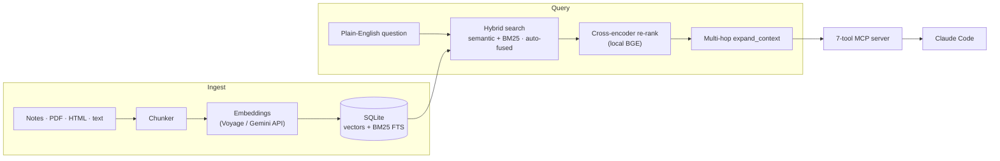

# corpus-rag

[](https://pypi.org/project/corpus-rag/) [](https://pypi.org/project/corpus-rag/) [](https://github.com/monahand1023/corpus/actions/workflows/ci.yml) [](LICENSE)

Your personal archive — notes, PDFs, docs — queryable in plain English, stored and searched entirely on your machine.

A personal knowledge system shouldn't require a vector database service, a SaaS subscription, or handing your whole archive to someone else's cloud. `corpus` is one Python process, one SQLite file, one MCP server — the database, index, and search all run locally. (One honest caveat: the text you ingest or query is sent to your chosen embedding API — Voyage or Gemini — to be turned into vectors. See [what corpus doesn't do](#what-corpus-doesnt-do).) Add a `corpus.toml`, point it at your data, run `corpus-ingest`, and Claude Code can search years of notes in under 300ms.

## How it works


```mermaid
flowchart LR
    subgraph Ingest
      Src["Notes · PDF · HTML · text"] --> Ch["Chunker"]
      Ch --> Emb["Embeddings<br/>(Voyage / Gemini API)"]
      Emb --> DB[("SQLite<br/>vectors + BM25 FTS")]
    end
    subgraph Query
      Q["Plain-English question"] --> Hy["Hybrid search<br/>semantic + BM25 · auto-fused"]
      DB --> Hy
      Hy --> RR["Cross-encoder re-rank<br/>(local BGE)"]
      RR --> Exp["Multi-hop expand_context"]
    end
    Exp --> MCP["7-tool MCP server"]
    MCP --> CC["Claude Code"]
```

Point it at any directory of markdown / PDF / HTML / text files and get:

- Semantic + BM25 hybrid search with auto-tuned fusion weights
- Source-diversity-aware retrieval (no single doc floods top-K)
- Multi-hop reference chasing via `expand_context`
- Optional cross-encoder re-ranker (local, BGE)
- Optional per-document Claude-Haiku summaries
- Seven MCP tools wired into Claude Code over stdio

**Stack:** Python 3.12–3.14 • Voyage or Gemini embeddings (optional extras) • SQLite + sqlite-vec • FastMCP. No AWS, no Docker, no Terraform.

---

## Quick start

```sh
# 1. Install — pick an embedder extra ([voyage] recommended, or [gemini])
pip install 'corpus-rag[voyage]'      # base + Voyage embeddings (recommended)
pip install 'corpus-rag[all]'         # + reranker, summarizer, pdf, html, gemini
# Bare `pip install corpus-rag` is the minimal, provider-agnostic base — you
# must add an embedder extra before you can ingest or query. Why it's split out:
# see "Why embedders are optional" in docs/configuration.md.

# 2. Interactive setup wizard — generates corpus.toml + .env
corpus-init

# 3. Paste your VOYAGE_API_KEY (free tier covers ~200M tokens) into .env
#    Sign up at https://dash.voyageai.com/  — or pick Gemini in the wizard
#    to use Google AI Studio's free tier instead.

# 4. Run the first ingest
corpus-ingest --source notes -v

# 5. Try it from the CLI
corpus-query "the question you wish you could ask your archive"

# 6. Wire it to Claude Code or Claude Desktop — see "MCP server" below
```

`corpus-init` walks you through 5 prompts (data path, format, embedder provider, etc.) and writes a working `corpus.toml`. No need to hand-edit anything to get started.

## Configuration

Everything that varies between deployments lives in `corpus.toml`. The wizard generates a starter file; edit by hand from there.

```toml
[corpus]
db_path = "./corpus.db"

[embedder]
provider = "voyage"           # or "gemini"
model = "voyage-4-large"
dim = 1024                    # must match the model's output dim

[retriever]
top_k = 5
max_per_source_type = 3       # diversity cap
hybrid = true                 # vector + BM25 via RRF

[[sources]]
name = "notes"                # free-form; used as source_type everywhere
type = "markdown"             # which built-in connector to use
path = "~/Documents/notes"
glob = "**/*.md"

[[references]]
# Optional. When set, `expand_context` chases these patterns across docs and
# the BM25 weight auto-tunes higher when the user's query contains a match.
pattern = '\b[A-Z]{2,}-\d+\b'
source_type = "tickets"
description = "Jira-style ticket keys"
```

Schema hazard: changing `embedder.dim` after data has been ingested would silently corrupt retrieval. `corpus` validates the dim against the existing schema at startup and refuses to proceed on mismatch.

## Credentials

Every CLI and the MCP server resolve API keys (`VOYAGE_API_KEY`, `GEMINI_API_KEY`/`GOOGLE_API_KEY`, `ANTHROPIC_API_KEY`) the same, predictable way, regardless of whether corpus is invoked as a console script (`corpus-query`) or imported as a library — both funnel through the same resolution, so which one you used never changes the answer. In order:

1. **An environment variable that's already set.** Never overwritten by a `.env` file — your real shell or CI environment always wins.
2. **A `.env` file next to the config file passed via `--config`.** This is the normal setup for a private archive repo: keep `corpus.toml` (or `docs.toml`, etc.) and `.env` together in that repo, and run the CLI from wherever you like.
3. **A `.env` file found by walking up from the current working directory.**
4. **Nothing.** corpus fails with a clear error naming the missing variable and exactly where it looked (beside `--config`, and in the cwd) — it never silently proceeds without a credential, and it never reads one out of corpus's own installed source tree.

corpus is a public engine, consumed by separate private archive repos — a checkout of corpus is never expected to hold a live API key itself, and it doesn't look for one there. See `corpus/credentials.py` for the implementation.

## Ingesting content

Ingestion turns a directory of files into searchable chunks. Point a `[[sources]]` block in `corpus.toml` at your data, then run the ingester:

```sh
corpus-ingest --source notes -v      # one source, verbose
corpus-ingest --all                  # every source in corpus.toml
```

What each run does:

1. **Walks** the source `path` for files matching `glob`. Symlinks and any path that resolves outside the configured directory are skipped — a stray symlink can't pull in files you didn't mean to index.
2. **Parses & chunks** each file with the connector for its `type` (frontmatter, headings, paragraph boundaries).
3. **Scrubs** obvious secrets (API keys, private-key blocks) out of the chunk text *before* anything is embedded or stored.
4. **Embeds** each chunk via your provider (Voyage or Gemini) and **stores** the vector + BM25 full-text index in SQLite.

Ingestion is **idempotent and incremental** — re-running it:

- **skips unchanged chunks** (matched by content hash — no re-embedding, no API cost),
- **re-embeds only what's new or changed**,
- **prunes orphans** — chunks whose source file was deleted are removed,
- **skips near-duplicate files** (identical body under a different name) within a run.

So the update loop is just: edit your files, re-run `corpus-ingest`. There's **no daemon or file watcher** — ingestion happens when you run the command. Dates come from frontmatter (`created`/`modified`) if present, else the file's modification time.

Out-of-the-box formats: **markdown**, **text**, **pdf** (`[pdf]` extra), **html** (`[html]` extra), **docx** (`[docx]` extra), **xlsx** (`[xlsx]` extra), **rtf** (`[rtf]` extra), **pptx** (`[pptx]` extra), **csv** / **tsv** (no extra needed), **zip** (archives of any of the above), **aup3** (Audacity 3 projects — metadata only; no extra needed) — see [Built-in connectors](#built-in-connectors). For anything else (Slack exports, JSON dumps, EPUB…), write a small connector: [`docs/adding_a_source.md`](docs/adding_a_source.md).

> **Upgrading?** `corpus` migrates its own SQLite database **automatically and
> in place** the first time you open it after an upgrade that changes how the
> full-text index is built (e.g. adding CJK support below) — there's no
> separate migration command to run or forget. It's a one-time rebuild of the
> `chunks_fts` table from content already stored in `chunks` (no
> re-embedding, no API cost, no network access), and it's crash-safe: if the
> process is killed mid-migration, it retries cleanly on the next open
> instead of leaving a half-rebuilt index. If the store already has chunks,
> you'll see two WARNING-level log lines naming the database path — one
> before the rebuild starts, one after with the row count rebuilt — because a
> migration rewriting your data should never be a silent side effect of
> opening a file. To open a store with a hard guarantee that it will *never*
> migrate (e.g. to inspect a backup unmodified), pass `read_only=True` to
> `ChunkStore` — `corpus-mcp` and `corpus-query` already do.

## Search behavior

Full-text (BM25/FTS5) search is Latin-script-first by default, with one
important exception: **CJK text (Japanese, Chinese, Korean-adjacent scripts)
is specially handled** because `unicode61` — the tokenizer FTS5 uses — can't
segment it. Japanese in particular has no spaces between words, so without
help a whole sentence indexes as a single token and a query like `東京`
would never match inside it.

`corpus` rewrites CJK runs into overlapping character bigrams (`東京で会議` →
`東京 京で で会 会議`) on **both** the index and query paths, so two-character
CJK words and phrases match the way whole words do for English. This trades
some ranking precision for coverage — an OR-joined bigram query can also
match documents that only share one bigram incidentally — so ranked order,
not just presence of a match, is what's asserted in tests
(`tests/test_db.py`). Query terms are de-duplicated and capped at 64 to bound
worst-case latency on long or repeated CJK queries.

**Measured cost:** indexing CJK content grows the FTS table by roughly
**2.4x** versus the equivalent English text; pure-English corpora see no
measurable growth (0%). This is a property of the `chunks_fts` table only —
your document content and vector index are unaffected.

Deliberately out of scope: Hangul (Korean) is excluded from the CJK bigram
handling — Korean isn't a target language and would need its own tokenizer
strategy — and NFKD/combining-mark normalization is deliberately *not*
applied, because it would map visually-similar-but-distinct Japanese kana
onto each other (e.g. がっこう "school" onto かっこう "cuckoo").

## MCP server

Wire `corpus` into **Claude Code** or **Claude Desktop** — both use stdio and the same config format. **Pass the absolute path to your `corpus.toml`** via `--config` — the client spawns the MCP server from an arbitrary CWD, so a relative path won't reliably find your config.

**Claude Code** — add to `~/.claude.json`:

```json
{
  "mcpServers": {
    "corpus": {
      "type": "stdio",
      "command": "corpus-mcp",
      "args": ["--config", "/absolute/path/to/your/corpus.toml"],
      "env": {}
    }
  }
}
```

After `pip install 'corpus-rag[voyage]'` (or another embedder extra), `corpus-mcp` is on your PATH. The client spawns it on demand.

**Claude Desktop** — add to `~/Library/Application Support/Claude/claude_desktop_config.json` (macOS):

```json
{
  "mcpServers": {
    "corpus": {
      "command": "uv",
      "args": [
        "--directory", "/absolute/path/to/your/corpus",
        "run", "corpus-mcp"
      ]
    }
  }
}
```

Use an absolute path to `uv` if it's not on the client's PATH. See [`docs/mcp_integration.md`](docs/mcp_integration.md) for more detail, including multiple-corpus setups.

Seven tools exposed:

| Tool | Purpose |
|---|---|
| `search_knowledge` | Hybrid BM25+vector search with dedupe + diversity |
| `expand_context` | Chase references from a chunk — siblings, cited docs, parent |
| `get_doc` | Pull every chunk of a specific document |
| `timeline` | Search results reordered chronologically |
| `recent_activity` | Chunks updated in the last N days |
| `get_summary` | Cached Claude-Haiku summary (after running `corpus-summarize`) |
| `corpus_stats` | Health check — total chunks + per-source counts |

The **investigation pattern** is the high-leverage flow: Claude calls `search_knowledge` to find entry points, then `expand_context` on the top result to pull in adjacent material (other chunks of the same doc, referenced doc IDs, parent links), then synthesizes from the full picture.

## CLI reference

```sh
corpus-init                              # interactive setup wizard
corpus-init --quiet                      # non-interactive (accept defaults; for CI)
corpus-list                              # show configured sources + chunk counts
corpus-ingest --source notes -v          # ingest one source
corpus-ingest --all                      # ingest everything in corpus.toml
corpus-query "your question" -k 10       # ad-hoc search
corpus-query "question" --source notes   # source-filtered
corpus-query "question" --rerank         # local BGE reranker (opt-in)
corpus-eval --queries my_queries.py      # recall@k against your queries
corpus-benchmark --runs 20               # latency profile
corpus-benchmark --compare voyage gemini # embed-latency A/B
corpus-summarize --source notes --dry-run    # estimate Haiku spend
corpus-summarize --source notes              # run it
corpus-reset --source notes              # drop one source's chunks
corpus-reset --all                       # delete the whole DB
corpus-mcp                               # stdio MCP server (Claude spawns it)
corpus-survey census ~/Downloads/export  # what's here, and can corpus index it?
corpus-survey archives ~/Downloads/export        # what's really inside these zips?
corpus-survey media ~/Downloads/recordings --rate 15  # how many hours, at 15x realtime?
corpus-survey overlap ~/Downloads/notes --db archive/corpus.db  # already indexed?
corpus-index ~/Downloads/export          # survey + plan + confirm + ingest, one command
corpus-index ~/Downloads/export --dry-run   # show the plan, write/ingest nothing
```

## corpus-index: point it at a folder

`corpus-index` is the one-command path from "here's a messy folder" to
"it's searchable" — the layer above `corpus-survey` and `corpus-ingest
--path` that does not require knowing either exists:

```bash
corpus-index ~/Downloads/export
```

It surveys the directory (reusing `corpus-survey census`), then prints,
**before touching anything**:

- **the gap** — file types corpus has no connector for, with counts and
  sizes. This is deliberately the first thing printed: it's the single most
  useful fact about a real directory, and a user should never have to ask
  for it separately.
- **noise** — how many directories (`node_modules`, `.git`, caches,
  `.photoslibrary` bundles, ...) were excluded by default, plus any
  loose-file noise (`.DS_Store`, minified JS, ...) found alongside real
  content.
- **the plan** — exactly which connectors will run over which files, with
  per-source file counts, sizes, and an estimated token count (a rough
  ceiling from file size, not a real tokenizer count — embedding is billed
  per token, and this is meant to catch a surprise before it happens, not
  to be exact).
- optionally, with `--check-overlap corpus.db`, an estimate of how much of
  the directory is already indexed somewhere else (reusing `corpus-survey
  overlap`) — so you can skip paying to re-embed content you already have.

Nothing is written or ingested until you confirm (`[y/N]`), pass `--yes`, or
until you decide `--dry-run` is enough and stop there:

```
corpus-index: /Users/you/Downloads/export

Gap — no connector (report this first; it's the whole point)
  extension                 count         size
  .csv                         913        41.2 MB
  .pptx                        259        88.0 MB
  -> 1,172 file(s), 129.2 MB that corpus cannot index today and will NOT
     be searchable after this run.

Noise (excluded from the plan, not ingested)
  4 directories excluded by default (node_modules, .git, caches, ...)

Plan — sources that would be written to corpus.toml and ingested
  name                     type      files       size   est. tokens
  export_markdown          markdown    340     6.1 MB      1,600,000
  export_pdf                pdf         52    18.4 MB      4,800,000
  TOTAL                                392    24.5 MB      6,400,000

Write these sources to corpus.toml and ingest? [y/N]
```

(Illustrative numbers — run it against your own directory.)

Confirmed sources are **merged into corpus.toml** (`[[sources]]` blocks are
appended, existing ones are never touched), not ingested transiently — a
one-off ingest nobody can repeat is a trap, since re-running the same
command is how you pick up files added or changed later. Re-running
`corpus-index` on a directory you already indexed is a no-op on the config
(reported as "already configured") and just re-ingests, picking up changes.

Source names follow the same folder-basename namespacing as `corpus-ingest
--path` (see below) — `export_pdf`, not `pdf` — but because `corpus-index`
*persists* sources across runs, two differently-located folders sharing a
basename (`~/Work/Inbox` and `~/Personal/Inbox`) can now actually collide in
one corpus.toml, which the transient `--path` mode never had to worry
about. `corpus-index` refuses that merge outright rather than guessing which
folder should win — deleting the wrong folder's chunks via `source_type`-scoped
orphan pruning is a real data-loss footgun — and tells you to pass
`--name-prefix` or edit corpus.toml by hand.

**Known limitation:** the noise directories excluded from the plan's counts
above are excluded only from what's *reported* — corpus's file connectors
don't yet have a directory-exclude mechanism of their own, so if a connector
type has real files both inside and outside a noise directory under the
same root, the actual ingest can still pick up what's inside it. Point
`--path`/`corpus-index`'s target at a narrower directory if a census shows
heavy noise-directory pruning.

## Ingesting a folder

`corpus-ingest --path` is the lower-level primitive `corpus-index` is built
on: point it at a directory and it works out which connectors apply, same
detection, same source naming — but ingests immediately, with no plan
preview and nothing written to corpus.toml:

```bash
corpus-ingest --path ~/Documents
```

It detects every supported file type present and ingests each as its own
source, so you never hand-write a `[[sources]]` block. `corpus.toml` still
supplies the database path and embedder — only the sources are superseded,
and only for this one run; next time you'd run the exact same command again.
Use this directly when you want a quick, throwaway ingest and don't need the
gap/noise report or a persisted config entry — `corpus-index` for everything
else.

Source names are namespaced by folder (`documents_pdf`, `inbox_pdf`), which
matters: orphan pruning is scoped by source type, so two folders sharing a bare
`pdf` name in one database would delete each other's chunks.

## Survey: deciding what to index

Before adding a directory to `corpus.toml`, `corpus-survey` answers the
questions that otherwise take several ad-hoc shell one-liners — read-only,
always: it never writes to a database, never extracts an archive to a
permanent location, never modifies the tree it looks at, and never follows
symlinks (matching corpus's own ingestion discovery — a survey that
disagrees with the ingester is worse than useless). Human-readable output by
default, `--json` for scripting, `--exclude PATTERN` (repeatable) to keep
caches/`node_modules`/photo libraries from hiding the signal.

- **`census PATH`** — file extensions with counts and sizes, split into what
  corpus can index (named by connector), the gap (real extensions with no
  connector — usually the most useful line in the output), and known noise
  it would ignore (`.DS_Store`, `__MACOSX/`, minified JS, compiled
  artifacts).
- **`archives PATH`** — per zip archive: member count, dependency/build-output
  noise, indexable-by-type breakdown, and a noise ratio, without ever
  extracting a byte — this is what tells "292 archives worth ingesting"
  apart from "3 deployment bundles that are 80% `node_modules`".
- **`media PATH --rate 15`** — audio/video file counts AND estimated total
  hours (sampled with `ffprobe`, extrapolated per type — a file count alone
  is useless for planning transcription), plus a processing-time projection
  at the given realtime multiple.
- **`overlap PATH --db corpus.db`** — samples distinctive phrases from `PATH`
  and checks them against an existing database's `chunks.content` (FTS
  recall + literal substring confirmation), reporting a percentage with a
  95% confidence interval, not a bare number — so you know whether ingesting
  `PATH` into that archive would mostly duplicate what's already there.

Worked example, run against this repo's own bundled `examples/sample_corpus`
(so it's reproducible — no invented numbers):

```
$ corpus-survey census examples/sample_corpus
corpus-survey census: examples/sample_corpus
Symlinks are not followed (matches corpus's own ingestion discovery).
Scanned 26 files, 1.2 MB total.

Gap — no connector (the interesting part)
  bucket                        count         size
  .db                               1       1.2 MB
  .db-shm                           1      32.0 KB
  .toml                             1        702 B
  .json                             2         66 B
  .db-wal                           1          0 B

Indexable (corpus has a connector)
  bucket                        count         size  detail
  .md                              20      17.4 KB  markdown

$ corpus-survey overlap examples/sample_corpus/notes --db examples/sample_corpus/corpus.db
corpus-survey overlap: examples/sample_corpus/notes  vs.  examples/sample_corpus/corpus.db
12 eligible plain-text document(s) found (binary formats like PDF/DOCX are not sampled — see corpus-survey census).
Sampled 12, 10 matched.
Estimated overlap: 83%  (95% CI: 55%–95%)
```

That 83% (not 100%) and the wide interval at a sample of 12 are both honest:
`notes/` genuinely is what's in `corpus.db`, but the phrase-substring check
undercounts documents where the sampled line got rewrapped or lightly
edited since indexing — which is exactly why the tool reports a confidence
interval instead of a single number.

## Built-in connectors

| `type` | Default glob | Extra needed | Notes |
|---|---|---|---|
| `markdown` | `**/*.md` | — | YAML frontmatter parsed (`title`, `id`, `url`, dates). Encoding: UTF-8, then CP932 (Shift-JIS), then latin-1 as a final fallback |
| `text` | `**/*.txt` | — | Plain text; title from filename stem. Encoding: UTF-8, then CP932 (Shift-JIS), then latin-1 as a final fallback |
| `pdf` | `**/*.pdf` | `pip install 'corpus-rag[pdf]'` | Uses `pypdf`. Scanned PDFs need OCR first. |
| `html` | `**/*.{html,htm}` | `pip install 'corpus-rag[html]'` | Uses `trafilatura` for boilerplate-stripped main-content extraction. Encoding: UTF-8, then CP932 (Shift-JIS), then latin-1 as a final fallback |
| `docx` | `**/*.docx` | `pip install 'corpus-rag[docx]'` | Uses `python-docx`. Body paragraphs and tables; legacy `.doc` unsupported |
| `xlsx` | `**/*.xlsx` | `pip install 'corpus-rag[xlsx]'` | Uses `openpyxl`. One doc per workbook; formulas read as cached values |
| `rtf` | `**/*.rtf` | `pip install 'corpus-rag[rtf]'` | Uses `striprtf` (pure Python). Title from filename stem. Encoding: UTF-8, then CP932 (Shift-JIS), then latin-1 as a final fallback |
| `pptx` | `**/*.pptx` | `pip install 'corpus-rag[pptx]'` | Uses `python-pptx`. Slide text AND speaker notes, one `##` section per slide. Legacy binary `.ppt` is a different container format `python-pptx` can never read — skipped, not retried, if found |
| `csv` | `**/*.csv` | — (stdlib `csv`) | Findability index, not a full row dump — see the design rationale in `src/corpus/connectors/csv_.py`'s module docstring. Small files (≤100 rows, ≤50k chars) are indexed in full; larger files get filename + inferred column names/types + a fixed 20-row head/tail sample. Header detection, delimiter, and encoding (UTF-8 with latin-1 fallback) are auto-detected per file |
| `tsv` | `**/*.tsv` | — (stdlib `csv`) | Same connector as `csv`; tab is just the fallback default when the delimiter can't be sniffed |
| `zip` | `**/*.zip` | — (stdlib `zipfile`; contents may need their own extra) | Extracts each archive to a temp dir, re-runs the connectors above by file type, deletes the extracted copies. Archives are never modified. Encrypted archives, zip-slip members, and nested archives are refused — see the safety contract in `src/corpus/connectors/zip.py`'s module docstring. Chunk `source_key`s look like `reports.zip::q3/summary.pdf`, so a search hit is traceable back to its archive. Vendored-dependency/build-output members (`node_modules`, `site-packages`, `.git`, minified `*.min.js`/`*.map`, ...) are excluded by default — set `exclude_dependencies = false` on the source to index them anyway. A member name written as raw UTF-8/Shift-JIS bytes without the standard UTF-8 flag bit (common from non-Python zip tools, especially Japanese-locale ones) is repaired rather than left as CP437 mojibake — see `_repair_filename_encoding` in `src/corpus/connectors/zip.py`. |
| `aup3` | `**/*.aup3` | — (stdlib `sqlite3`; `ffmpeg` optional for FLAC/MP3 extraction) | Audacity 3 project files — SQLite databases holding raw audio. The indexed document is metadata only (duration, block count, sample-format verdict) — audio content isn't text and can't be chunked/embedded directly. Call `corpus.connectors.aup3.extract_audio()` separately to write a playable WAV (stdlib)/FLAC/MP3 (via `ffmpeg`) file adjacent to the source, for a future transcription pass. The source `.aup3` is opened read-only and never modified. Sample rate and channel count aren't recoverable from the project file — defaults to 44100 Hz mono; override per source with `sample_rate` / `channels`. |

## Adding a new source type

For Slack exports, JSON dumps, an internal API archive, EPUB books — write your own connector. See [`docs/adding_a_source.md`](docs/adding_a_source.md) for the walkthrough with a worked JSON-files example.

## Eval

`corpus-eval` runs hand-written known-answer queries against the live corpus and reports **recall@K, MRR, and nDCG@K**, plus an aggregate table, a per-source-type breakdown, and `--json`. It's a regression signal — run it after changing chunking, switching embedders, or tweaking retrieval.

**Zero setup, no API key:** `corpus` ships a committed sample corpus (`examples/sample_corpus/` — 20 docs, two source types) and a keyless `hash` embedder (`provider="hash"`) so you can try the whole eval loop with nothing installed and no key on file:

```sh
uv run corpus-ingest --config examples/sample_corpus/corpus.toml --all
uv run corpus-eval   --config examples/sample_corpus/corpus.toml
```

```
=== Aggregate (n=30) ===
  recall@5: 1.000
  MRR:       0.865
  nDCG@5:   0.898

=== By source_type ===
  source_type         n   recall      mrr     ndcg
  faq                11    1.000    0.955    0.966
  note               19    1.000    0.813    0.859
```

The `hash` embedder is a **reproducibility substrate, not a semantic-quality model** — it approximates lexical overlap, not meaning. It exists so the eval (and CI) has a deterministic, free baseline. Absolute retrieval quality is measured on your real corpus with `voyage` or `gemini`. See [`docs/eval.md`](docs/eval.md) for the exact metric formulas and that distinction in full.

CI runs this same keyless flow as a regression gate (`eval-gate` in `.github/workflows/ci.yml`): it fails the build if the sample corpus's recall@5 or nDCG@5 drops below the floors in `examples/sample_corpus/thresholds.json` — see [docs/eval.md](docs/eval.md#ci-gate-phase-3) for details.

Write your own queries in any Python file that defines `EVAL_QUERIES`, then pass `--queries path/to/your_queries.py`:

```python
# my_queries.py
from dataclasses import dataclass, field

@dataclass(frozen=True)
class EvalQuery:
    query: str
    expected_keys: list[str] = field(default_factory=list)
    source_filter: list[str] | None = None
    source_type: str | None = None   # bucket tag for the per-source-type breakdown
    note: str = ""

EVAL_QUERIES = [
    EvalQuery(
        query="how does the payment flow work?",
        expected_keys=["payment-design-doc"],
        source_type="doc",
        note="paraphrased to stress semantic retrieval",
    ),
    # add more...
]
```

```sh
corpus-eval --queries my_queries.py --top-k 5     # baseline
corpus-eval --queries my_queries.py --rerank      # with the BGE reranker
corpus-eval --queries my_queries.py --no-hybrid   # vector-only baseline
corpus-eval --queries my_queries.py --compare     # metric x config table (hybrid vs vector-only vs +rerank)
corpus-eval --queries my_queries.py --json        # structured output for tooling / CI
```

`--compare` runs the whole query set under several retrieval configs in one invocation:

```
=== Config comparison (top_k=5) ===
  config             recall      mrr     ndcg
  hybrid              1.000    0.865    0.898
  vector-only         0.933    0.838    0.861
```

**Finding:** on this corpus, hybrid beats vector-only on all three metrics — recall 1.000 vs. 0.933, MRR 0.865 vs. 0.838, nDCG@5 0.898 vs. 0.861 — so fusing BM25 with vectors earns its place even on a purely lexical `hash` embedder ([full writeup](docs/eval.md#results)).

Tips: paraphrase away from doc titles to stress semantic retrieval on a real embedder (the shipped sample-corpus queries deliberately do the opposite, since the `hash` embedder has only lexical overlap to work with); list multiple `expected_keys` when several docs are valid answers; add a few negative queries (empty `expected_keys`) to confirm the corpus correctly fails on absent topics.

See [`docs/eval.md`](docs/eval.md) for the full methodology — precise metric definitions, the `EvalQuery` schema, and reading the reports and `--json` shape. New to evals entirely? [`docs/understanding-evals.md`](docs/understanding-evals.md) explains RAG and evaluation from scratch (no prior knowledge assumed).

## Generation quality (LLM-as-judge)

`corpus-eval` scores *retrieval*; `corpus-judge` scores the *answer generated
from* what was retrieved. It runs retrieve → answer-from-context → judge, rating
each answer on three axes — **faithfulness**, **answer relevance**, and
**citation correctness** — with a stronger model judging than generating. The
judge itself is validated against human labels via Cohen's κ (`--validate`), so
its verdicts are trustworthy before you rely on them. Requires
`ANTHROPIC_API_KEY`; it never runs over a private corpus in CI (see
[`docs/judge.md`](docs/judge.md)).

```sh
corpus-judge --queries my_queries.py --config corpus.toml            # 3-axis aggregate
corpus-judge --queries my_queries.py --config corpus.toml --rerank   # +BGE reranker
corpus-judge --validate --fixture tests/judge_fixture.py             # certify the judge (κ)
```

Because the judge scores answers against the retrieved context, the loop also
**measures whether a retrieval change helps generation**: run with and without
`--rerank` (or vary `--top-k`) and compare the aggregates — the signal is the
delta between configs, not any single absolute rate.

## Benchmarking

`corpus-benchmark` measures per-stage retrieval latency (embed / vector / FTS / fusion / dedupe) with p50/p95/p99 + throughput.

```sh
corpus-benchmark --runs 20                      # latency profile
corpus-benchmark --queries my_queries.py        # use your own query set
corpus-benchmark --compare voyage gemini        # embed-latency A/B
corpus-benchmark --json out.json
```

Typical profile on an M-series Mac, few-thousand-chunk corpus: `embed` dominates at 100–300ms (provider API round-trip), while `vector_search` / `fts_search` / `fusion` / `dedupe` are collectively under ~5ms. The optimization lever is "fewer or concurrent embed calls," not "faster SQLite." If `vector_search` exceeds ~50ms you've outgrown brute-force `vec0` (~100K chunks) and want HNSW indexing.

`--compare` measures embedder-API latency only — it does **not** compare retrieval quality, because two providers' vectors aren't comparable against one DB. For quality, ingest each provider into its own corpus and run `corpus-eval` against each.

## What corpus doesn't do

`corpus` is deliberately small and single-purpose. The following are **non-goals, not missing features** — know them before you adopt it:

- **Not multi-user.** One person, one machine. No accounts, auth, access control, sharing, or multi-tenancy.
- **No network service.** It talks over stdio (the MCP server) and the CLI — there is no HTTP/REST/SSE API and no web UI.
- **Embedding is not local, for real retrieval.** Storage, the vector + full-text index, hybrid search, and the optional reranker all run on your machine — but turning text into vectors for actual semantic search requires the **Voyage or Gemini API** (an API key + network at ingest and query time). The only built-in offline embedder, `provider="hash"` (see [Eval](#eval)), is a keyless lexical-overlap substrate for eval/CI reproducibility, not a semantic-quality model — for real retrieval, the text you ingest and your queries are sent to whichever provider you pick. If that's a dealbreaker, this isn't the tool.
- **Not built for huge corpora.** Vector search is a brute-force scan (sqlite-vec `vec0`), fast to roughly **100K chunks**. Beyond that you'd want ANN/HNSW indexing, which isn't included.
- **No OCR.** Scanned or image-only PDFs produce no text — OCR them first.
- **No live sync.** No file watcher and no real-time/incremental indexing daemon — you re-run `corpus-ingest` when content changes.
- **Not an LLM or chatbot.** `corpus` only *retrieves* — it finds and returns the relevant chunks. The answering/reasoning is done by whatever model consumes them (e.g. Claude via the MCP server).
- **Python 3.12+ only** (tested on 3.12, 3.13, and 3.14).

If you need any of the above, `corpus` is the wrong starting point — though its pieces (the SQLite schema, connectors, retriever) are small enough to lift into something larger.

## Where your data lives

`corpus` is a generic engine — a library that builds and serves an index, not a place to keep one. It never holds data itself.

The intended shape is one private *consumer* repo per archive (the pattern used by `a mail consumer`, `a media consumer`, `a document consumer`, and similar projects): its own `data/` directory for the database, its own `corpus.toml` pointing at real source paths, and no public remote. That consumer repo depends on `corpus`; `corpus` never depends on knowing where anyone's data lives, and its own source tree is never where an index belongs.

A database or a real `corpus.toml` inside `corpus`'s own package directory or repo root is always a mistake, even though nothing stops you from creating one by accident:

- It survives only as long as `.gitignore` happens to stay correct — and `corpus` is a public repo, so one rewritten `.gitignore`, one `git add -f`, or one new file pattern nobody thought to exclude is the distance between an accident and a real leak.
- An untracked file sitting there is exactly what `git clean -fdx` deletes outright.

`corpus` notices and warns when a database path resolves inside its own package or checkout (see `ChunkStore`), and its own test suite fails if a database or a real config ever appears in this repo. But the fix, if you see that warning, is architectural, not a flag to silence it: move `db_path` outside `corpus` entirely, into your own consumer project.

## Documentation

| Doc | What it covers |
|---|---|
| [`docs/understanding-evals.md`](docs/understanding-evals.md) | **New to RAG or evals? Start here.** RAG and AI evaluation explained from scratch — retrieval vs generation, LLM-as-judge, Cohen's κ, reading results, and the noise trap |
| [`docs/configuration.md`](docs/configuration.md) | Every `corpus.toml` setting + env var, including the Voyage-vs-Gemini embedder choice |
| [`docs/mcp_integration.md`](docs/mcp_integration.md) | Claude Code + Claude Desktop wiring, all 7 tools, the investigation pattern |
| [`docs/adding_a_source.md`](docs/adding_a_source.md) | Walkthrough for writing a custom connector |
| [`docs/troubleshooting.md`](docs/troubleshooting.md) | Common problems and the actual fixes |

Architecture overview, benchmarking, and eval methodology are covered inline in this README (sections above).

## Develop locally

Want to hack on the framework, write a new connector, or run the tests? Clone and use [uv](https://docs.astral.sh/uv/):

```sh
git clone https://github.com/monahand1023/corpus.git
cd corpus
uv sync --all-extras                 # creates .venv with all deps (incl. embedders)
./scripts/install-hooks.sh           # wires this checkout's pre-commit guard (see below)
uv run pytest tests/ -q              # run the suite
uv run ruff check src/ tests/        # lint
uv run corpus-init                   # the CLI scripts are also available via `uv run`
```

The repo includes `examples/sample_corpus/` (synthetic markdown notes) and `examples/corpus.toml.example` (wired to point at it) for try-before-you-config experiments.

`scripts/install-hooks.sh` points this checkout's `core.hooksPath` at the tracked `.githooks/` directory, whose `pre-commit` hook blocks committing a database file, a root `corpus.toml`, or `.env` — even via `git add -f`. `core.hooksPath` is per-checkout git config, not something a clone inherits, so this is a convenience for catching your own mistakes locally, not a guarantee: run the script again after every fresh clone. `tests/test_repo_hygiene.py` (part of the normal test suite, and run in CI) is the guard that actually can't be skipped.

## License

MIT — see [LICENSE](LICENSE).
